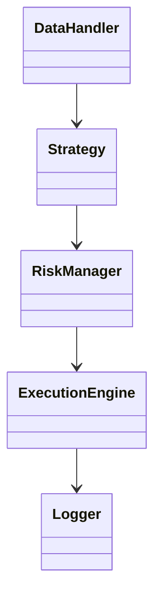

# API Reference

## 1. Core Classes & Interfaces

- **DataHandler**
  - `fetch_live_data()`
  - `fetch_historical_data()`
  - `preprocess()`
- **Strategy (Base Class)**
  - `on_startup()`
  - `on_data()`
  - `on_order_fill()`
  - `on_shutdown()`
  - `generate_signals()`
- **RiskManager**
  - `check_order()`
  - `monitor_positions()`
- **ExecutionEngine**
  - `send_order()`
  - `cancel_order()`
  - `get_order_status()`
- **Logger**
  - `log_event()`
  - `log_trade()`

---

## 2. Module Relationship Diagram



---

## 3. Configuration Schema

```yaml
mt5:
  login: <int>
  password: <encrypted>
  server: <string>
  path: <string>

strategies:
  - name: <string>
    params:
      ...

risk:
  max_daily_loss: <float>
  max_position_size: <float>
  stop_loss: <float>
  take_profit: <float>

logging:
  level: <string>
  file: <string>

alerts:
  email: <string>
  telegram: <string>
```

---

## 4. Advanced Notes
- All public methods are documented with input/output types.
- Config schema is versioned and validated at runtime.
- API docs are auto-generated as code evolves.

---

> **TODO:** Add docstrings and type hints in code for auto-generation tools.
