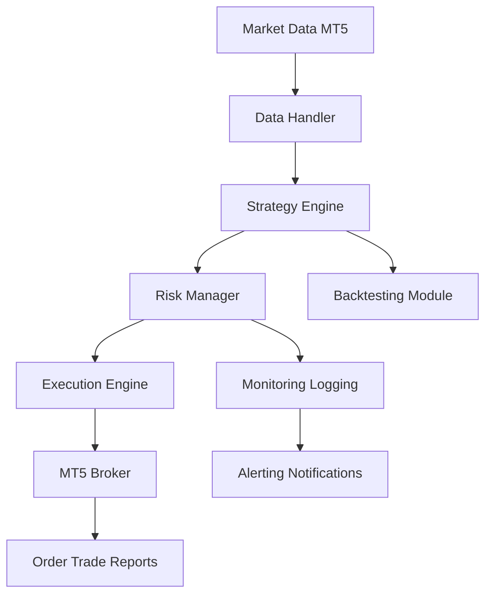

# System Architecture

## High-Level Architecture Diagram

## Component Descriptions
- **Data Handler**: Fetches, cleans, and stores live/historical data.
- **Strategy Engine**: Houses all trading logic, supports plug-and-play strategies.
- **Risk Manager**: Enforces risk rules before orders are sent.
- **Execution Engine**: Interfaces with MT5 for order management.
- **Backtesting Module**: Simulates strategies on historical data.
- **Monitoring & Logging**: Tracks system health, logs events, and sends alerts.

## Process Flows
- Data ingestion and normalization
- Signal generation and risk checks
- Order execution and reconciliation
- Monitoring, logging, and alerting

---

> **TODO:** Expand with detailed sequence and class diagrams for each subsystem.
