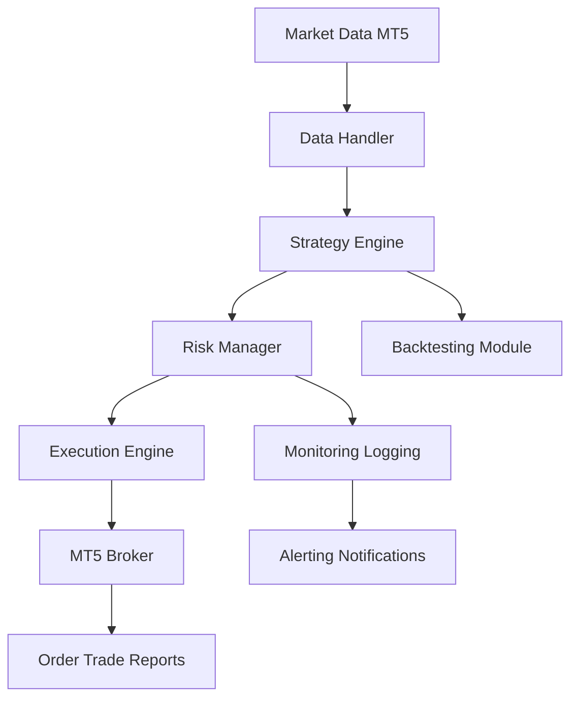
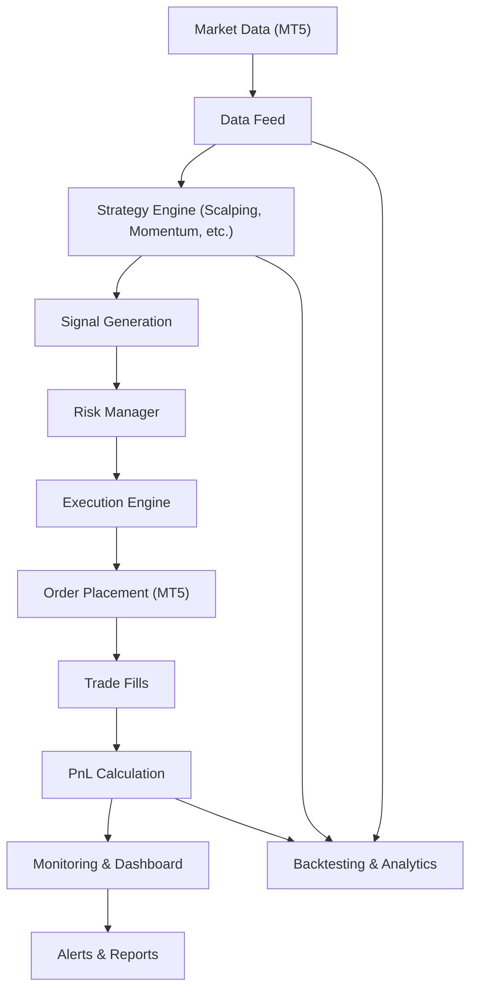
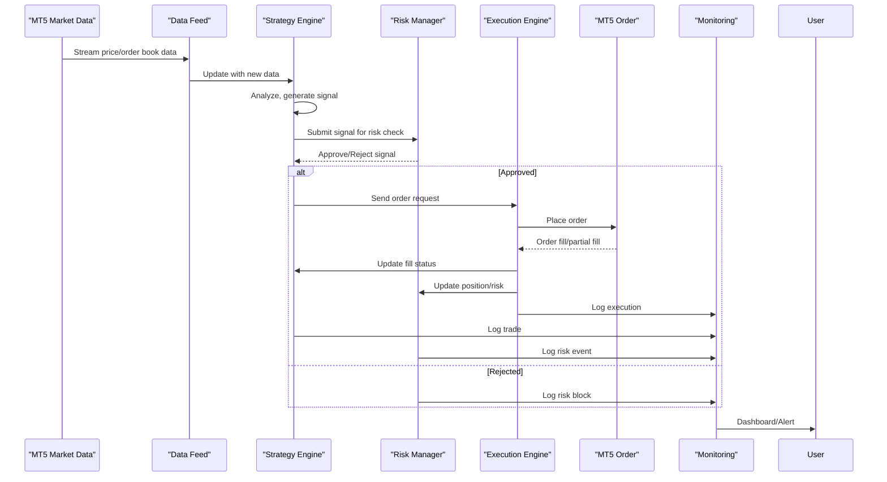

# System Architecture

## High-Level Architecture Diagram

## Component Descriptions
- **Data Handler**: Fetches, cleans, and stores live/historical data.
- **Strategy Engine**: Houses all trading logic, supports plug-and-play strategies.
- **Risk Manager**: Enforces risk rules before orders are sent.
- **Execution Engine**: Interfaces with MT5 for order management.
- **Backtesting Module**: Simulates strategies on historical data.
- **Monitoring & Logging**: Tracks system health, logs events, and sends alerts.

## Process Flows
- Data ingestion and normalization
- Signal generation and risk checks
- Order execution and reconciliation
- Monitoring, logging, and alerting

---

> **TODO:** Expand with detailed sequence and class diagrams for each subsystem.

## End-to-End Flow Diagram

## How the System Makes (or Loses) Money

The system is designed to generate profits by systematically identifying and exploiting market opportunities using advanced trading strategies. Here’s how it works in practice:

1. **Market Data Ingestion:**
   - Real-time price, order book, and volume data are continuously ingested from MetaTrader 5 (MT5).

2. **Strategy Engine:**
   - Multiple strategies (e.g., scalping, momentum) analyze the data to detect trading opportunities.
   - Each strategy has well-defined entry and exit rules, risk controls, and position sizing logic.

3. **Signal Generation:**
   - When a strategy identifies a high-probability opportunity, it generates a buy or sell signal with confidence and sizing.

4. **Risk Management:**
   - Every signal is checked against real-time risk limits (VaR, drawdown, leverage, concentration).
   - The risk manager can block trades or trigger a kill switch if limits are breached.

5. **Execution Engine:**
   - Orders are routed to the market using smart tactics to minimize slippage and market impact.
   - The engine tracks fills, partial fills, and execution quality.

6. **PnL Calculation:**
   - Profits and losses are calculated in real time as positions are opened and closed.
   - PnL attribution is tracked per strategy, symbol, and time period.

7. **Monitoring & Alerts:**
   - The system provides dashboards and alerts for performance, risk, and operational health.
   - Anomalies, large losses, or risk breaches trigger immediate notifications.

8. **Backtesting & Analytics:**
   - All strategies are rigorously backtested on historical data to validate profitability and robustness.
   - Walk-forward analysis and parameter optimization are used to avoid overfitting.

### **Profit Example:**
- A scalping strategy detects a temporary order book imbalance and buys EURUSD at 1.1000.
- The price moves to 1.1003, and the system sells, capturing a 3-pip profit minus transaction costs.
- The PnL is updated, and the trade is logged for performance analysis.

### **Loss Example:**
- A momentum strategy enters a long position, but the market reverses.
- The stop-loss is triggered, closing the position at a loss.
- The risk manager records the loss, and the system may reduce position sizes or pause trading if losses accumulate.

---

**This end-to-end flow ensures that every trade is systematically evaluated, executed, and monitored, with profits and losses transparently tracked and risk tightly controlled.**

## Trade Lifecycle Sequence Diagram

---

## User Story: A Day in the Life of a Trade

1. **Market Data Arrives:**
   - MT5 streams EURUSD price and order book updates to the Data Feed.
2. **Strategy Detects Opportunity:**
   - The scalping strategy sees a bid-ask imbalance and generates a BUY signal.
3. **Risk Check:**
   - The Risk Manager checks if the trade fits within VaR, drawdown, and leverage limits.
4. **Order Execution:**
   - The Execution Engine places a market order via MT5. The order is filled at 1.1002.
5. **Position Monitoring:**
   - The system tracks the open position, updating PnL in real time.
6. **Exit Triggered:**
   - The price hits the take-profit at 1.1005. The position is closed, and profit is realized.
7. **PnL Attribution:**
   - The trade’s profit is attributed to the scalping strategy and logged.
8. **Dashboard Update:**
   - The Monitoring system updates the dashboard and, if the profit is significant, sends a notification.
