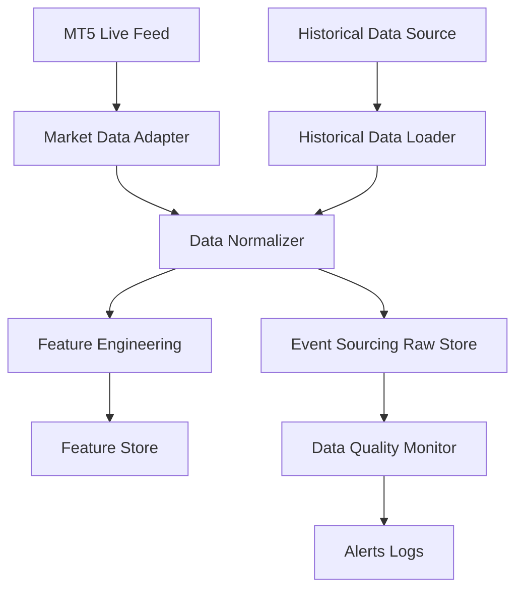
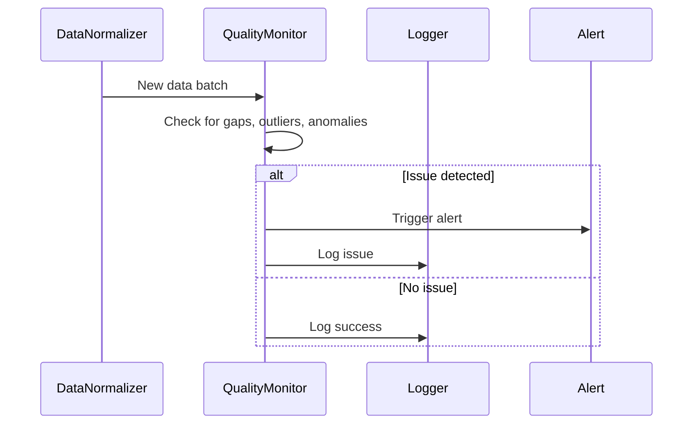

# Data Pipeline

## 1. Data Ingestion Flow

---

## 2. Event Sourcing & Storage
- All raw and processed data events are stored for replay and audit.
- Data is versioned for reproducibility.
- Storage options: in-memory (for speed), persistent (CSV, Parquet, SQL, HDF5).

---

## 3. Data Quality Monitoring Sequence

---

## 4. Advanced Notes
- Adapters abstract all data sources (MT5, REST, FIX, CSV, etc.).
- Normalization ensures all data is in a canonical format (timestamp, symbol, bid/ask, volume, etc.).
- Feature engineering is modular and supports ML workflows.
- Automated data quality checks with alerting for missing or anomalous data.

---

> **TODO:** Add code/config references for adapters, normalization, and quality checks.
