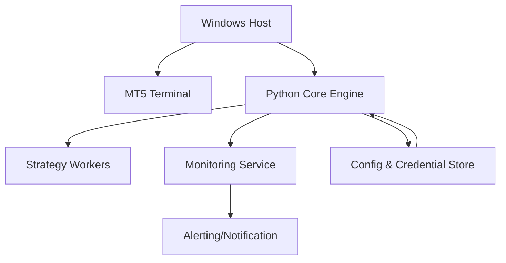
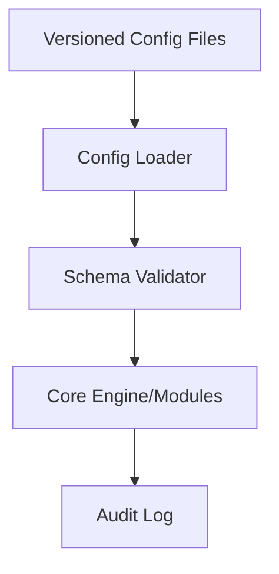
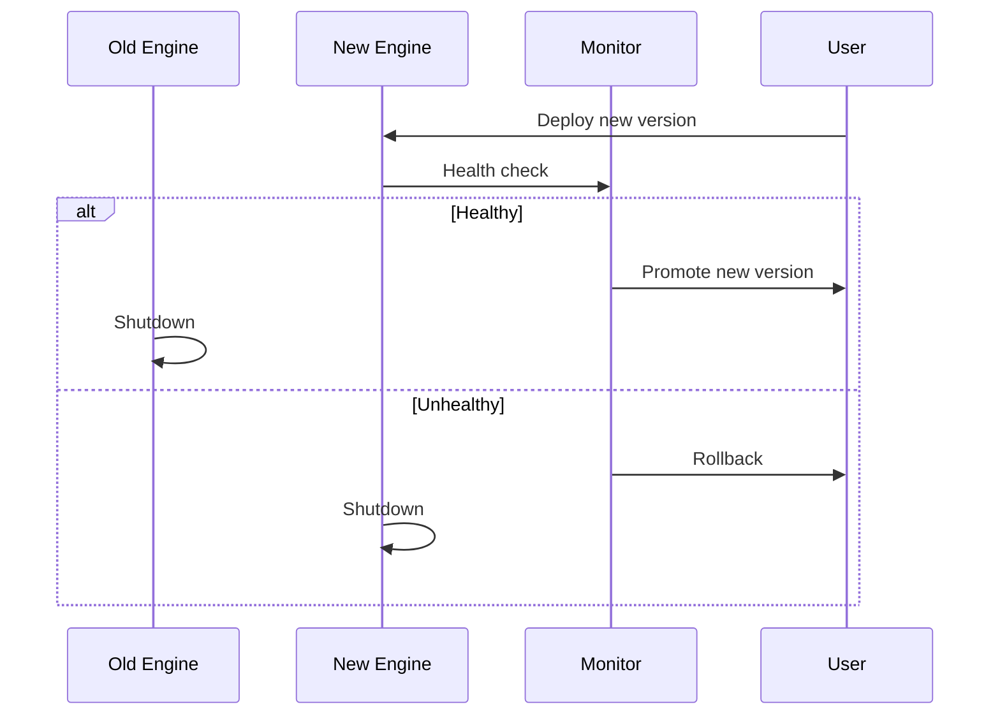
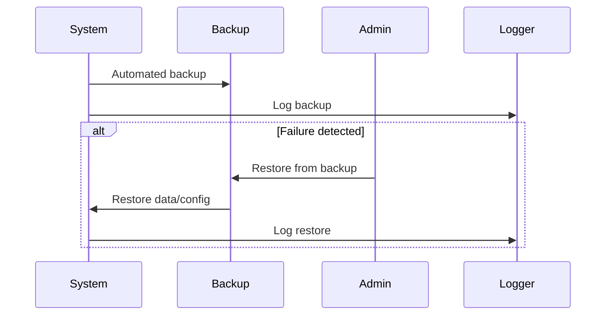

# Deployment & Operations

## 1. Deployment Architecture

---

## 2. Configuration Management Flow

---

## 3. Zero-Downtime Deployment Sequence

---

## 4. Disaster Recovery Flow

---

## 5. Advanced Notes
- All deployments are versioned and validated before going live.
- Automated health checks and monitoring for all services.
- Disaster recovery procedures are tested regularly.

---

> **TODO:** Add deployment scripts and runbooks for common scenarios.
