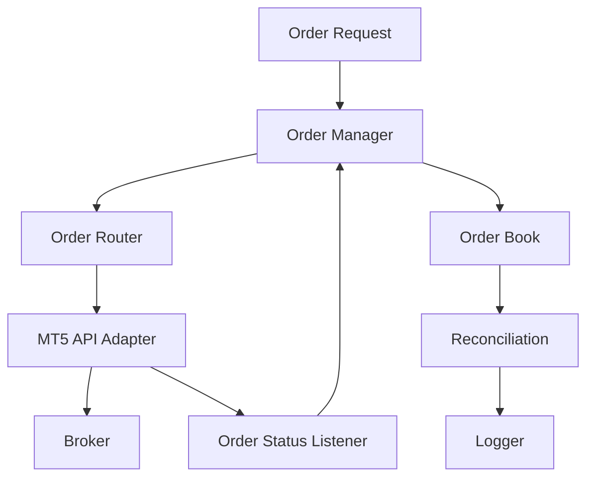
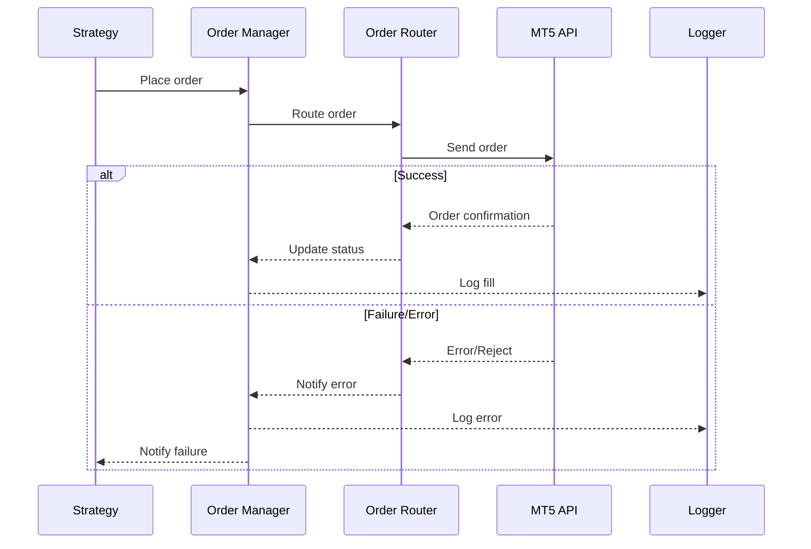
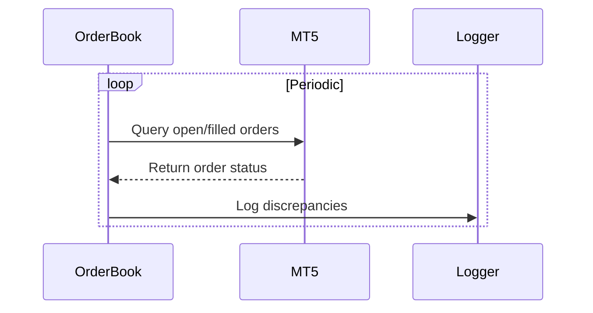
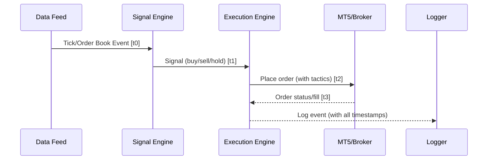

# Execution & Order Management

## 1. Order Lifecycle Flow

---

## 2. Order Placement & Error Handling Sequence

---

## 3. Reconciliation Process

---

## 4. Advanced Notes
- Asynchronous, non-blocking order placement and status polling.
- Internal order book tracks all open, filled, and canceled orders.
- Reconciliation ensures system and broker state are always in sync.
- All order events and errors are logged for auditability.

---

## 5. Execution Microstructure & Latency Management (Expert Level)

### 5.1. Order Book State Machine
- Track order book events: new order, cancel, modify, trade, partial fill
- Maintain internal state for best bid/ask, depth, queue position, and imbalance
- Detect microstructure signals: sweep, fade, spoof, hidden liquidity

### 5.2. Latency Budget & Event Timing
- Map end-to-end latency: data feed → signal → order → broker → fill
- Profile and optimize each stage (network, processing, broker, exchange)
- Use nanosecond-precision clocks and timestamping

### 5.3. Market Impact & Slippage Modeling
- Estimate expected slippage based on order size, liquidity, and volatility
- Model market impact for aggressive vs. passive orders
- Simulate adverse selection and partial fill scenarios in backtests

### 5.4. Advanced Execution Tactics
- Iceberging, layering, and randomization to minimize footprint
- Smart order routing (SOR) for best venue/liquidity
- Adaptive order sizing and timing based on real-time market conditions
- Immediate-or-cancel (IOC), fill-or-kill (FOK), and pegged order logic

### 5.5. Microsecond-Level Execution Flow Diagram

### 5.6. Actionable Implementation Notes
- Use a high-resolution event loop (asyncio, Cython, or C++ extension)
- Maintain a rolling order book state for microstructure analysis
- Timestamp every event at each stage for latency analysis
- Integrate market impact and slippage models into backtesting and live execution
- Continuously profile and optimize latency at every stage

---

> **TODO:** Add code references for order manager and reconciliation logic.
> **TODO:** Add pseudocode and code snippets for order book state machine and execution tactics.
