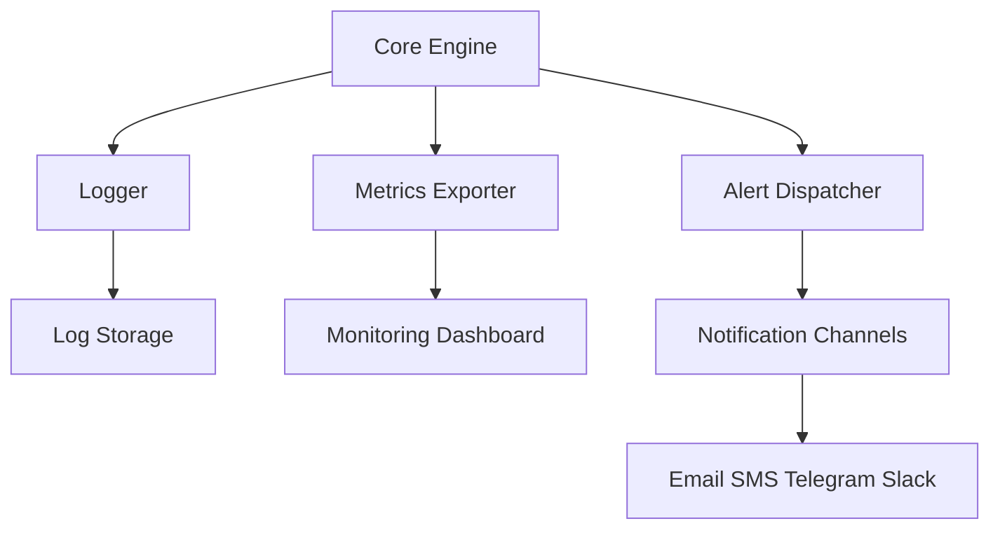
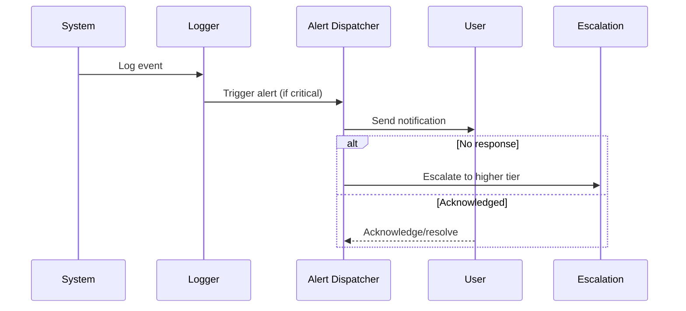
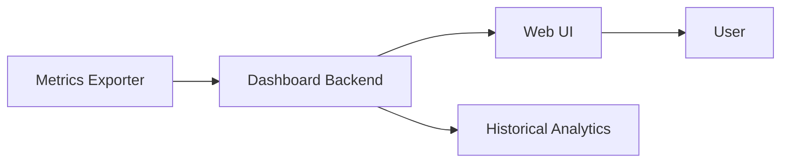
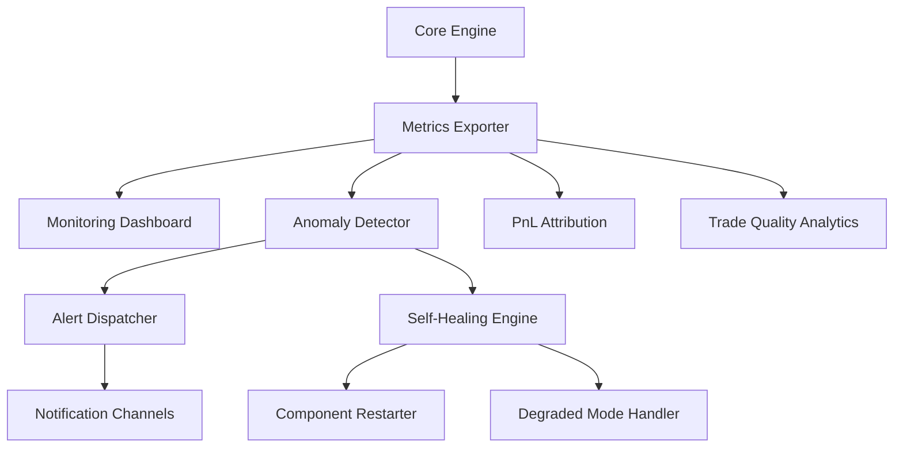

# Monitoring & Observability

## 1. Monitoring Architecture

---

## 2. Alert Escalation Flow

---

## 3. Dashboard Data Flow

---

## 4. Advanced Notes
- All logs are structured (JSON) for easy parsing and analysis.
- Metrics are exported in real time for system health and trading performance.
- Alerts are multi-channel and support escalation policies.
- Dashboards provide both real-time and historical analytics.

---

> **TODO:** Add code/config references for logging, metrics, and alerting integrations.

---

## 5. Advanced Monitoring, Analytics & Self-Healing (Expert Level)

### 5.1. Real-Time PnL Attribution
- Attribute PnL in real time by strategy, symbol, time bucket, and trade
- Track realized/unrealized PnL, fees, and slippage
- Visualize PnL curves and heatmaps for diagnostics

### 5.2. Trade Quality Analytics
- Analyze slippage, fill ratios, opportunity cost, and trade clustering
- Monitor trade execution quality and market impact
- Generate post-trade forensics and performance reports

### 5.3. Anomaly Detection & Alerting
- Real-time detection of abnormal PnL, latency spikes, fill anomalies, and market regime shifts
- Automated alerting with severity levels and escalation policies
- Integrate with dashboards and notification channels

### 5.4. Self-Healing & Watchdog Flows
- Automated recovery from common failures (data feed loss, order rejection, process crash)
- Watchdog processes to monitor system health and restart components as needed
- Degraded mode operation for partial system failures

### 5.5. Monitoring & Self-Healing Flow Diagram

### 5.6. Actionable Implementation Notes
- Use streaming metrics and logs for real-time monitoring
- Integrate anomaly detection models for early warning
- Implement watchdogs and self-healing logic for all critical components
- Provide dashboards with drill-downs for diagnostics and forensics
- Log all monitoring, alerting, and recovery actions for audit

---

> **TODO:** Add pseudocode and code snippets for anomaly detection and self-healing modules.
