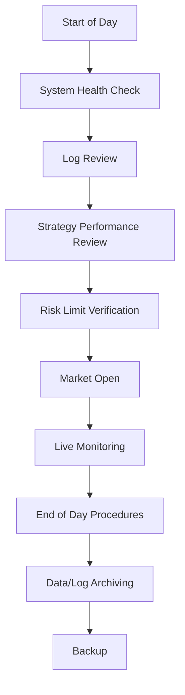
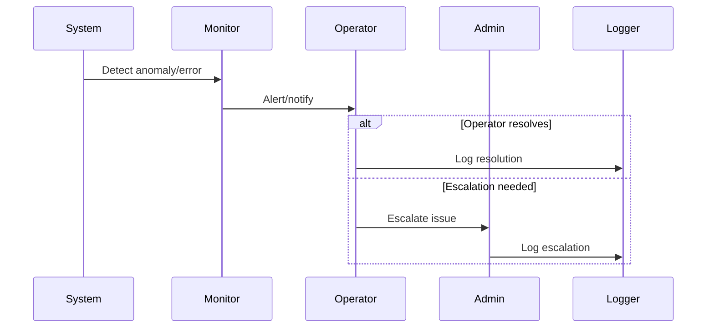
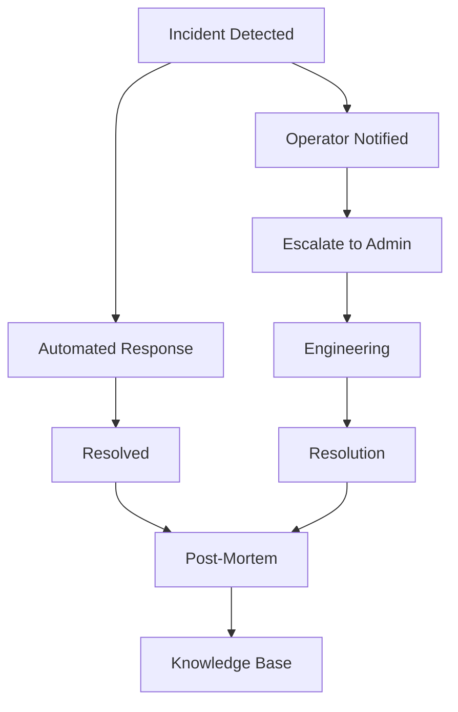

# Operations & Runbooks

## 1. Daily Operations Checklist

---

## 2. Incident Response Flow

---

## 3. Maintenance Schedule
- Regular dependency and system updates
- Periodic data and log archiving
- Scheduled risk and performance reviews
- Backup and disaster recovery drills

---

## 4. Advanced Notes
- All operational procedures are documented and versioned.
- Incident response and escalation paths are clearly defined.
- Maintenance is scheduled to minimize trading disruption.

---

## 5. Operational Playbooks & Runbooks (Expert Level)

### 5.1. Live Trading Runbook
- Pre-market system checks (data feeds, broker connectivity, risk limits)
- Strategy activation and capital allocation
- Real-time monitoring and escalation procedures
- End-of-day reconciliation and reporting

### 5.2. Incident Response & Escalation
- Automated and manual incident detection (system, market, or operational)
- Escalation paths: operator → admin → engineering
- Communication protocols and notification templates
- Incident logging and resolution tracking

### 5.3. Post-Mortem & Continuous Improvement
- Structured post-mortem template (root cause, impact, resolution, action items)
- Review cycles for recurring issues and process improvement
- Knowledge base for incident learnings

### 5.4. Parameter Tuning & Online Learning Flows
- Scheduled and event-driven parameter tuning (hyperparameter optimization, rolling validation)
- Online learning and adaptation for live strategies
- Safe deployment and rollback procedures

### 5.5. Incident Response & Escalation Flow Diagram

### 5.6. Actionable Implementation Notes
- Maintain up-to-date runbooks and escalation contacts
- Automate as much of the incident response as possible
- Use structured post-mortems for all significant incidents
- Continuously review and improve operational procedures

---

## Operational Playbook: Handling Losses, Risk Breaches, and Anomalies

### 1. Losses Exceed Daily Threshold
- **Action:**
  - System triggers a kill switch and halts trading.
  - Review trade logs and PnL attribution to identify the source.
  - Adjust strategy parameters or disable underperforming strategies.
  - Resume trading only after risk review.

### 2. Risk Limit Breach (VaR, Drawdown, Leverage)
- **Action:**
  - System blocks new trades and sends an alert.
  - Investigate which strategy or symbol caused the breach.
  - Reduce position sizes or capital allocation.
  - Document the incident and corrective actions.

### 3. System Anomaly Detected (Data Feed, Execution, Monitoring)
- **Action:**
  - System sends an alert and logs the anomaly.
  - Check system health dashboards and logs.
  - Restart affected components if needed.
  - Escalate to engineering if unresolved.

### 4. Post-Mortem & Continuous Improvement
- **Action:**
  - After any major incident, conduct a post-mortem.
  - Document root cause, impact, and lessons learned.
  - Update runbooks and risk controls as needed.

---

## Change Management & Model Approval
- All code and model changes must be peer-reviewed and signed off by a senior quant or manager.
- Use the following checklist for each change:
  - [ ] Change request logged (JIRA, GitHub, etc.)
  - [ ] Peer review completed
  - [ ] Model validation and backtest results attached
  - [ ] Risk/compliance review (if applicable)
  - [ ] Approval/sign-off recorded
  - [ ] Change merged and deployed via controlled release process

## Deployment & Release Management
- Use a release checklist for every deployment:
  - [ ] All tests (unit, integration, backtest) pass
  - [ ] Rollback plan in place
  - [ ] Stakeholders notified
  - [ ] Monitoring/alerting enabled for new release
  - [ ] Post-release review scheduled

## Disaster Recovery & Business Continuity
- Maintain up-to-date failover and recovery playbooks:
  - [ ] Automated and manual backup procedures
  - [ ] Broker/data feed outage response
  - [ ] System failover and restart steps
  - [ ] Communication/escalation plan
  - [ ] Regular disaster recovery drills

## Professional Standards Checklist
- [ ] Change management and peer review in place
- [ ] Model validation and risk backtesting documented
- [ ] Audit trail and compliance logs maintained
- [ ] Disaster recovery and business continuity plans tested
- [ ] Security and access control reviewed
- [ ] Performance attribution and post-mortems conducted
- [ ] Onboarding and training materials up to date
- [ ] All documentation reviewed and versioned

---

> **TODO:** Add runbook templates and post-mortem forms for operational excellence.

---

## Onboarding & Training

### Onboarding Guide
- [ ] Obtain access to code repository, data feeds, and trading systems
- [ ] Review all core documentation (architecture, strategy framework, risk, operations)
- [ ] Set up local development and backtesting environment
- [ ] Complete code walkthrough with a senior team member
- [ ] Review recent post-mortems and incident reports
- [ ] Meet with risk, compliance, and operations leads
- [ ] Complete required compliance and security training

### Training Checklist
- [ ] Read core system and strategy docs
- [ ] Complete hands-on exercises (e.g., add a new strategy, run a backtest)
- [ ] Review risk and compliance procedures
- [ ] Pass code review and deployment simulation
- [ ] Attend regular team knowledge-sharing sessions

---

## Regulatory Compliance & Reporting

### Compliance Checklist
- [ ] All trading activity logged and auditable
- [ ] Regular compliance reviews and sign-offs
- [ ] Regulatory reporting schedule maintained
- [ ] All models and strategies reviewed for compliance
- [ ] Data privacy and retention policies followed
- [ ] All staff complete annual compliance training

### Reporting Templates
- **Regulatory Report:**
  - Date, time, and summary of trading activity
  - List of all trades, positions, and exposures
  - Risk metrics (VaR, drawdown, leverage, etc.)
  - Compliance sign-off
- **Risk Report:**
  - Portfolio exposures and risk metrics
  - Stress test results
  - Incident log and risk events
- **Performance Report:**
  - PnL attribution by strategy, desk, and time
  - Win rate, Sharpe, drawdown, and other KPIs
  - Commentary and review

---

## Weekly/Monthly Review Meeting Template

| Date       | Attendees | Topics | Action Items | Owner | Deadline |
|------------|-----------|--------|--------------|-------|----------|
| YYYY-MM-DD |           |        |              |       |          |

**Agenda:**
- Strategy performance review
- Risk and compliance updates
- Incident and post-mortem review
- Research and alpha pipeline updates
- Technology and operations review
- Open issues and action items

## Change Log & Release Notes Template

| Date       | Change/Release | Description | Impact | Owner | Reviewer |
|------------|---------------|-------------|--------|-------|----------|
| YYYY-MM-DD |               |             |        |       |          |

---

## Vendor & Third-Party Risk Management

### Vendor Assessment Checklist
- [ ] Due diligence on vendor reputation and financial stability
- [ ] Security and compliance certifications reviewed
- [ ] Service level agreements (SLAs) in place
- [ ] Data privacy and handling policies reviewed
- [ ] Regular performance and reliability reviews

### Third-Party Incident Response
- [ ] Identify and contain impact (e.g., switch to backup provider)
- [ ] Notify stakeholders and compliance
- [ ] Document incident and response
- [ ] Review and update vendor risk policies

---

## Knowledge Base Structure
- Organize documentation by:
  - System architecture and components
  - Strategy playbooks and research logs
  - Risk, compliance, and audit
  - Operations, onboarding, and training
  - Incident reports, post-mortems, and case studies
- Use version control and access permissions
- Regularly review and update for accuracy

## Feedback Loop Template
| Date       | Feedback Source | Topic/Area | Feedback | Action Taken | Owner | Deadline |
|------------|----------------|------------|----------|--------------|-------|----------|
| YYYY-MM-DD |                |            |          |              |       |          |

---

## Regulatory Mapping & Global Compliance

### Jurisdictional Matrix
| Requirement         | MiFID II | SEC | CFTC | FCA | MAS | System Feature/Control         |
|---------------------|---------|-----|------|-----|-----|-------------------------------|
| Trade Logging       |    X    |  X  |  X   |  X  |  X  | Full audit trail, log export   |
| Best Execution      |    X    |  X  |      |  X  |     | Execution quality analytics    |
| Pre-Trade Risk      |    X    |     |  X   |  X  |  X  | Real-time risk checks         |
| Post-Trade Reporting|    X    |  X  |  X   |  X  |  X  | Automated reporting pipeline   |
| Data Privacy        |    X    |     |      |  X  |  X  | GDPR/CCPA compliance           |
| Model Validation    |    X    |  X  |      |  X  |     | Model risk management docs     |
| Compliance Training |    X    |  X  |  X   |  X  |  X  | Training checklist             |

### Global Compliance Playbook
- [ ] Identify applicable regulations for each jurisdiction
- [ ] Map system features/controls to regulatory requirements
- [ ] Maintain up-to-date compliance documentation and logs
- [ ] Schedule regular compliance reviews and audits
- [ ] Implement cross-border data handling and reporting procedures
- [ ] Onboard new jurisdictions with legal/compliance review

---

## Doc Generation Pipeline
- Use Sphinx, MkDocs, or similar tools to auto-generate:
  - API documentation from code docstrings
  - Configuration schema docs from YAML/JSON
  - Compliance and risk reports from logs/metrics
- Schedule regular doc builds and publish to internal portal

## Automated Audit Trail Export
- Script/process to export all logs, trades, and compliance events for:
  - Regulatory review
  - Internal audit
  - Incident investigation
- Ensure exports are versioned, encrypted, and access-controlled

---
