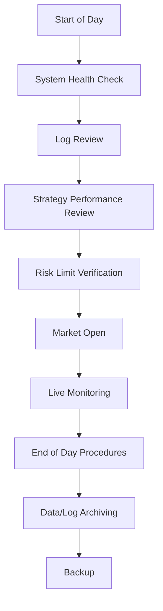
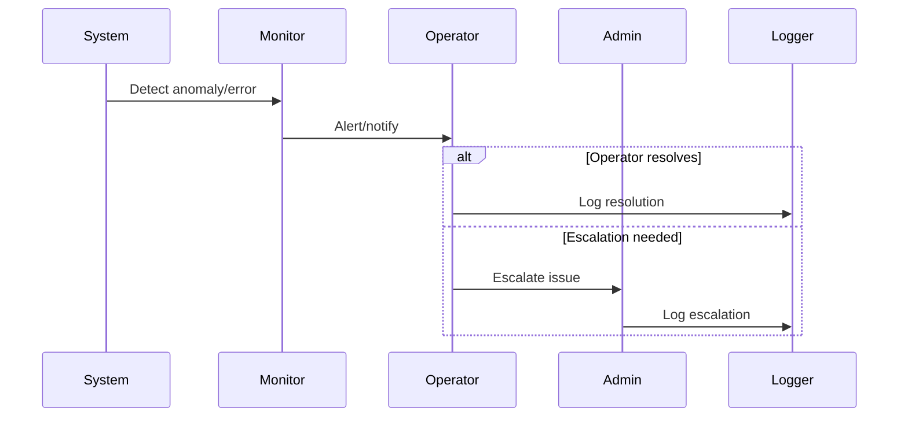
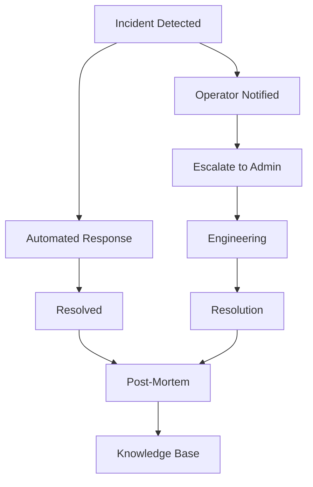

# Operations

## 1. Daily Operations Checklist

---

## 2. Incident Response Flow

---

## 3. Maintenance Schedule
- Regular dependency and system updates
- Periodic data and log archiving
- Scheduled risk and performance reviews
- Backup and disaster recovery drills

---

## 4. Advanced Notes
- All operational procedures are documented and versioned.
- Incident response and escalation paths are clearly defined.
- Maintenance is scheduled to minimize trading disruption.

---

## 5. Operational Playbooks & Runbooks (Expert Level)

### 5.1. Live Trading Runbook
- Pre-market system checks (data feeds, broker connectivity, risk limits)
- Strategy activation and capital allocation
- Real-time monitoring and escalation procedures
- End-of-day reconciliation and reporting

### 5.2. Incident Response & Escalation
- Automated and manual incident detection (system, market, or operational)
- Escalation paths: operator → admin → engineering
- Communication protocols and notification templates
- Incident logging and resolution tracking

### 5.3. Post-Mortem & Continuous Improvement
- Structured post-mortem template (root cause, impact, resolution, action items)
- Review cycles for recurring issues and process improvement
- Knowledge base for incident learnings

### 5.4. Parameter Tuning & Online Learning Flows
- Scheduled and event-driven parameter tuning (hyperparameter optimization, rolling validation)
- Online learning and adaptation for live strategies
- Safe deployment and rollback procedures

### 5.5. Incident Response & Escalation Flow Diagram

### 5.6. Actionable Implementation Notes
- Maintain up-to-date runbooks and escalation contacts
- Automate as much of the incident response as possible
- Use structured post-mortems for all significant incidents
- Continuously review and improve operational procedures

---

> **TODO:** Add runbook templates and post-mortem forms for operational excellence.
