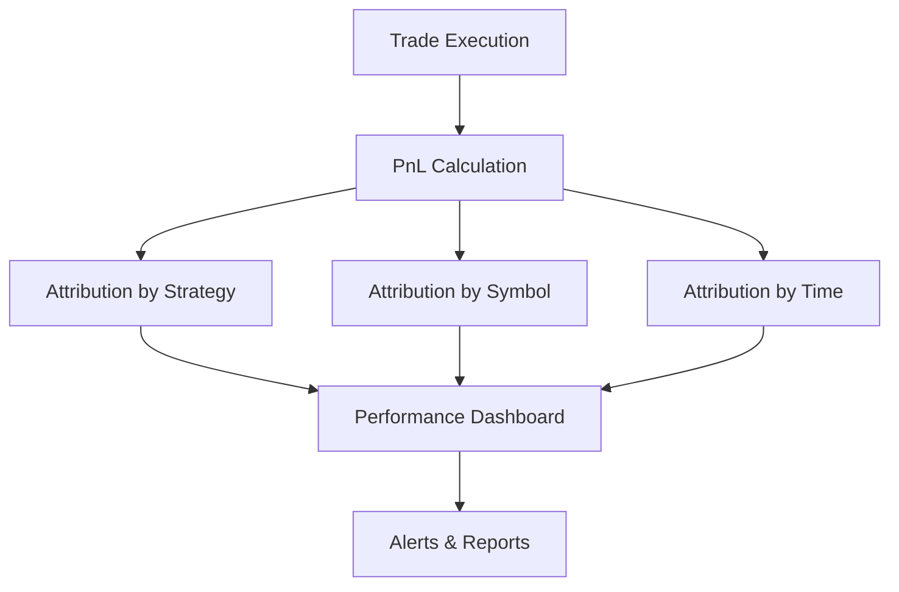

# PnL Attribution & Performance Analysis

## Overview

Profit and Loss (PnL) attribution is the process of tracking, categorizing, and analyzing profits and losses generated by the trading system. This enables:
- Transparency into which strategies, symbols, or time periods are profitable
- Early detection of underperforming components
- Data-driven decision making for capital allocation and risk

## How PnL is Tracked

- **Real-Time Calculation:**
  - As trades are executed, the system updates open and closed PnL for each position.
  - PnL is calculated per trade, per strategy, per symbol, and per time period (daily, weekly, monthly).
- **Attribution Dimensions:**
  - **By Strategy:** Scalping, momentum, etc.
  - **By Symbol:** EURUSD, GBPUSD, etc.
  - **By Time:** Intraday, daily, weekly, monthly.
- **Performance Metrics:**
  - Win rate, profit factor, Sharpe ratio, drawdown, and more are computed for each dimension.

## Example Table: PnL Attribution

| Strategy  | Symbol  | Trades | Win Rate | Total PnL | Max Drawdown | Sharpe |
|-----------|---------|--------|----------|-----------|--------------|--------|
| Scalping  | EURUSD  | 120    | 62%      | $2,300    | 3.2%         | 1.8    |
| Momentum  | GBPUSD  | 80     | 55%      | $1,100    | 4.1%         | 1.2    |
| Scalping  | USDJPY  | 60     | 58%      | $900      | 2.7%         | 1.5    |

## PnL Flow Diagram

## How to Use PnL Attribution

- **Performance Review:**
  - Identify which strategies or symbols are consistently profitable or losing.
- **Risk Management:**
  - Detect drawdowns or risk concentrations early.
- **Optimization:**
  - Allocate more capital to high-performing strategies, reduce or disable underperformers.

## Example: Investigating a Loss

1. The dashboard shows a sudden drop in daily PnL.
2. PnL attribution reveals the momentum strategy on GBPUSD is responsible.
3. The operator reviews trade logs and risk metrics for that strategy.
4. Parameters are adjusted, or the strategy is paused if needed. 