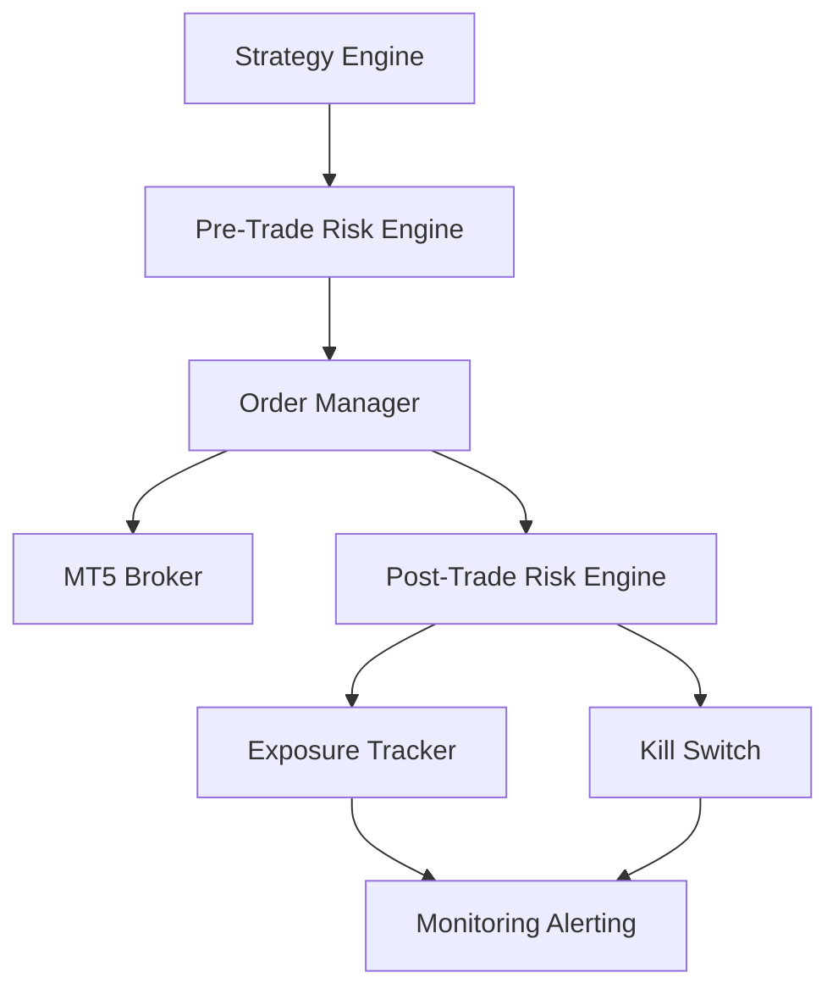
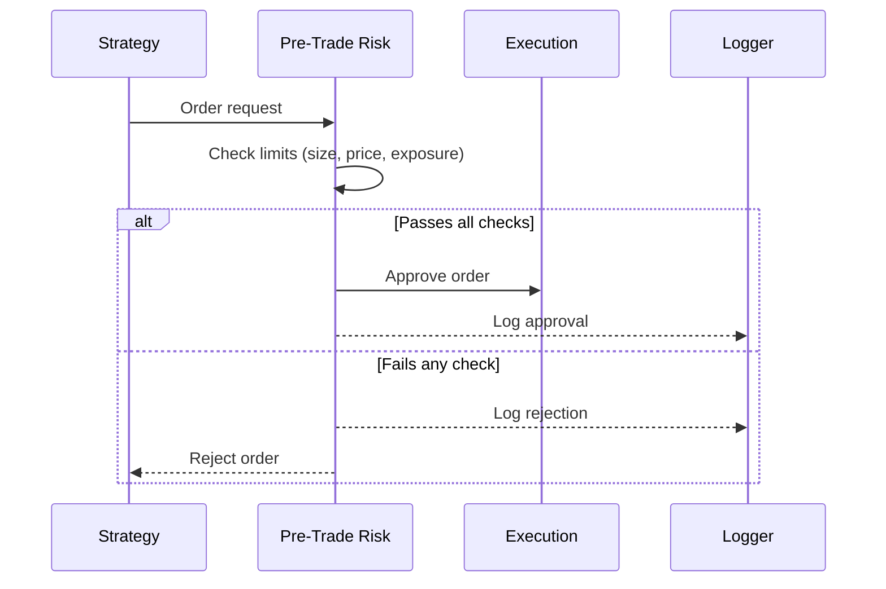
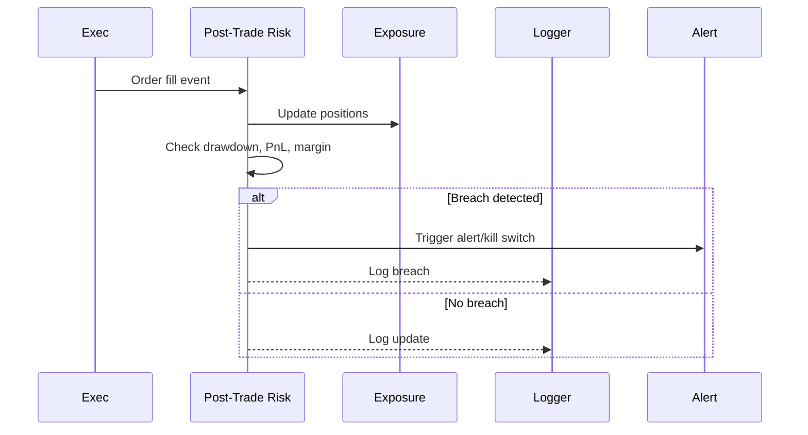
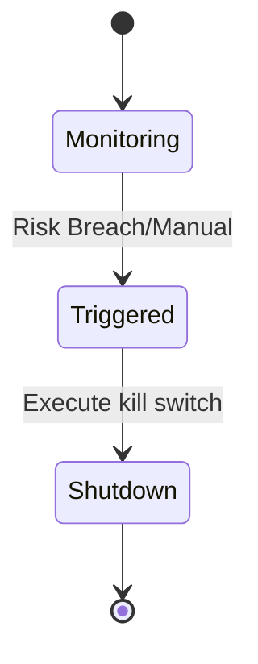
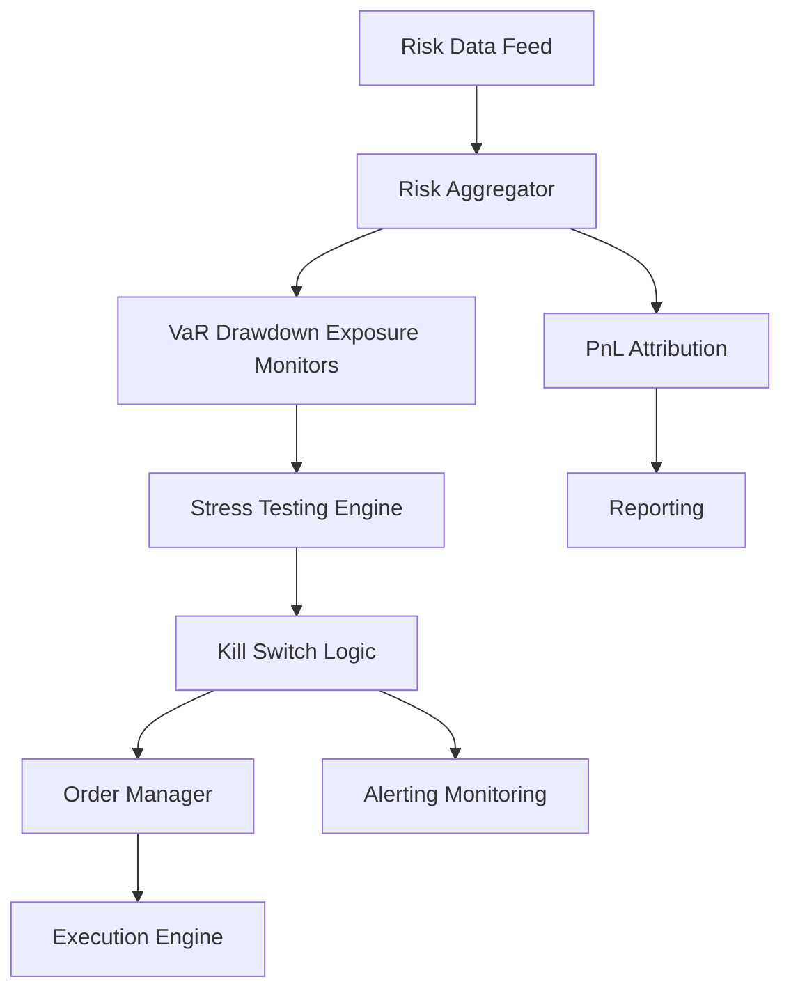

# Risk Management

## 1. Risk Control Architecture

---

## 2. Pre-Trade Risk Sequence

---

## 3. Post-Trade Risk & Monitoring

---

## 4. Kill Switch State Diagram

---

## 5. Advanced Notes
- All risk checks are parameterized and strategy-aware.
- Real-time monitoring of exposure, drawdown, and margin.
- Automated and manual kill switches for safety.
- All risk events are logged and auditable.

---

## 6. Real-Time Risk Aggregation & Kill Switch Logic (Expert Level)

### 6.1. Multi-Dimensional Risk Aggregation
- Aggregate risk in real time across strategies, symbols, asset classes, and timeframes
- Track exposures: gross/net, sector, currency, leverage, margin usage
- Real-time VaR (Value at Risk), expected shortfall, and scenario analysis
- Drawdown and PnL attribution by strategy, symbol, and time bucket

### 6.2. Real-Time Stress Testing
- Simulate market shocks (flash crash, spread widening, volatility spike)
- Apply stress scenarios to current portfolio and open orders
- Monitor risk metrics under stress in real time

### 6.3. Kill Switch Logic
- Hard and soft kill switches for risk breaches (drawdown, exposure, margin, connectivity)
- Automated triggers: immediate flattening of positions, order cancellation, system halt
- Manual triggers: secure web UI or CLI for operator intervention
- Backtest kill switch logic using historical risk events

### 6.4. Real-Time Risk Aggregation & Kill Switch Flow Diagram

### 6.5. Actionable Implementation Notes
- Use a real-time risk engine with streaming data architecture
- Parameterize all risk limits and allow for dynamic adjustment
- Integrate kill switch logic with both automated and manual triggers
- Backtest risk aggregation and kill switch logic using historical data
- Log all risk events and actions for audit and compliance

---

> **TODO:** Add pseudocode and code snippets for real-time risk aggregation and kill switch modules.
