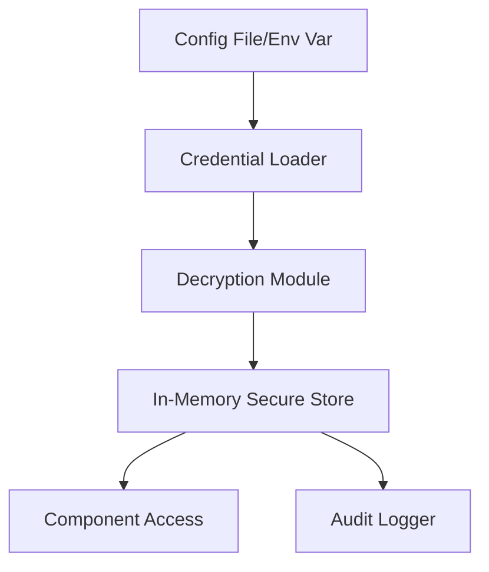
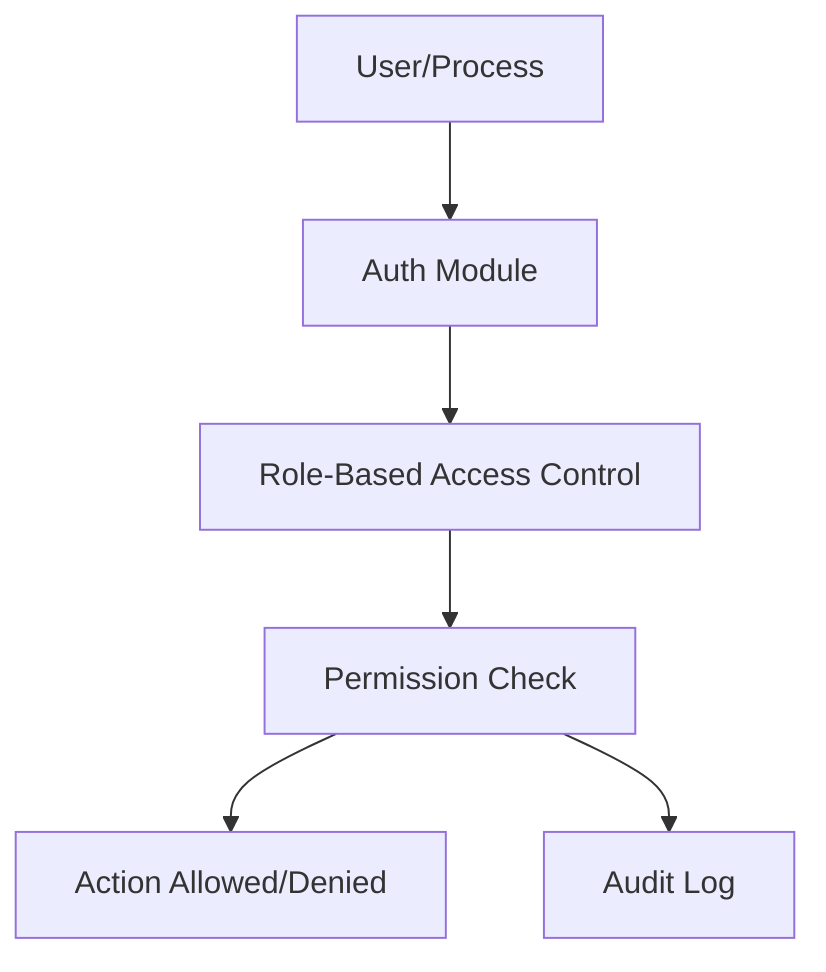
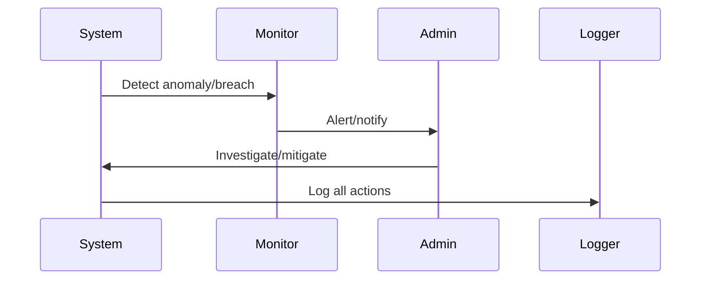
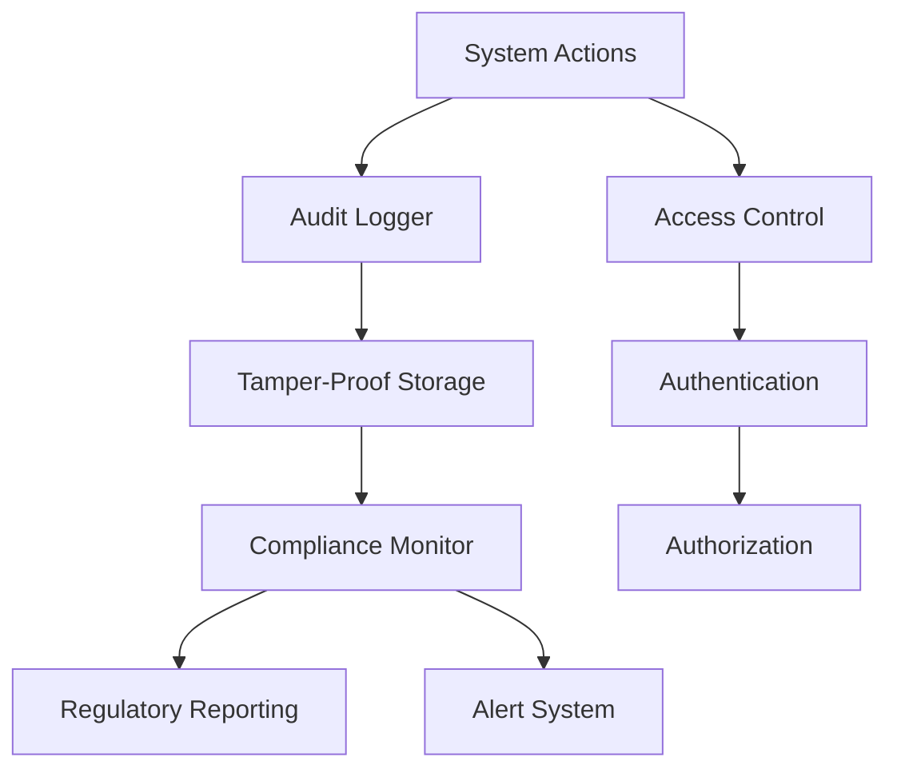

# Security & Compliance

## 1. Credential Management Flow

---

## 2. Access Control Architecture

---

## 3. Incident Response Flow

---

## 4. Advanced Notes
- All credentials are encrypted at rest and only decrypted in memory.
- Role-based access control for all sensitive actions.
- All access and security events are logged for compliance.
- Incident response procedures are documented and tested.

---

## 5. Advanced Security, Compliance & Audit (Expert Level)

### 5.1. Real-Time Compliance Monitoring
- Monitor for wash trading, spoofing, layering, and market manipulation
- Track order-to-trade ratios, cancellation rates, and order book manipulation
- Real-time alerts for potential compliance violations
- Integration with regulatory reporting systems

### 5.2. Audit Trail & Tamper-Proofing
- Immutable audit logs for all trades, orders, and system actions
- Cryptographic signatures and blockchain-style integrity checks
- Time-stamped logs with user/process attribution
- Secure storage and backup of audit trails

### 5.3. Access Control & Security
- Role-based access control (RBAC) for all system components
- Multi-factor authentication for sensitive operations
- Secure credential management and encryption
- Network security and intrusion detection

### 5.4. Compliance & Audit Flow Diagram

### 5.5. Actionable Implementation Notes
- Use cryptographic hashing and digital signatures for audit trail integrity
- Implement real-time compliance monitoring with configurable thresholds
- Maintain secure, encrypted storage for all sensitive data
- Regular security audits and penetration testing

---

> **TODO:** Add compliance check templates and audit trail implementation details.
