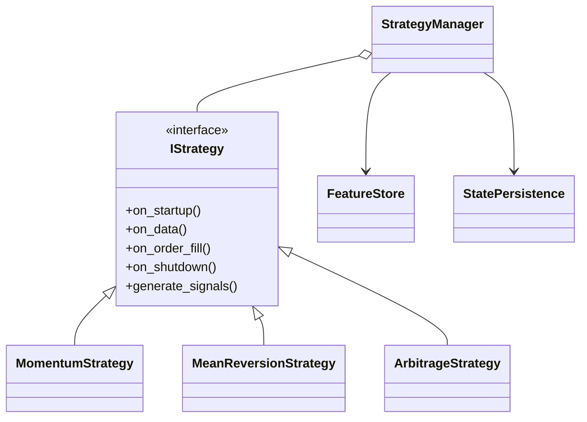
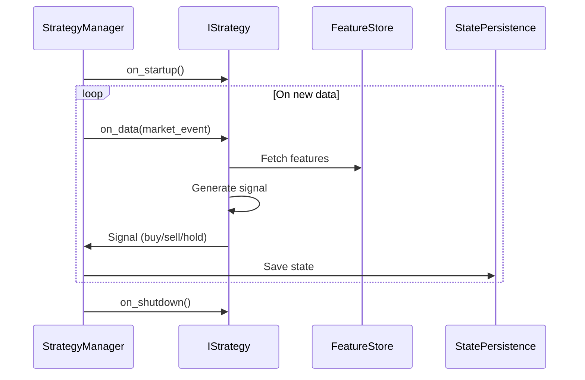
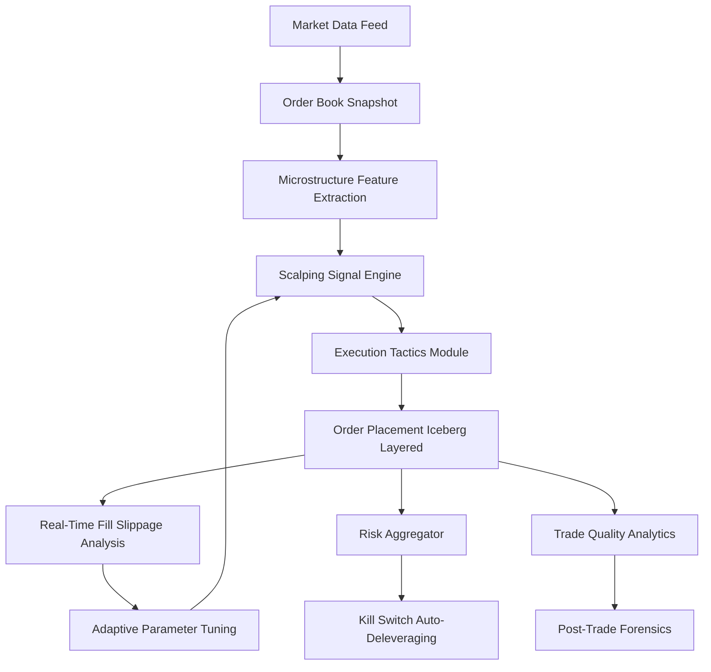
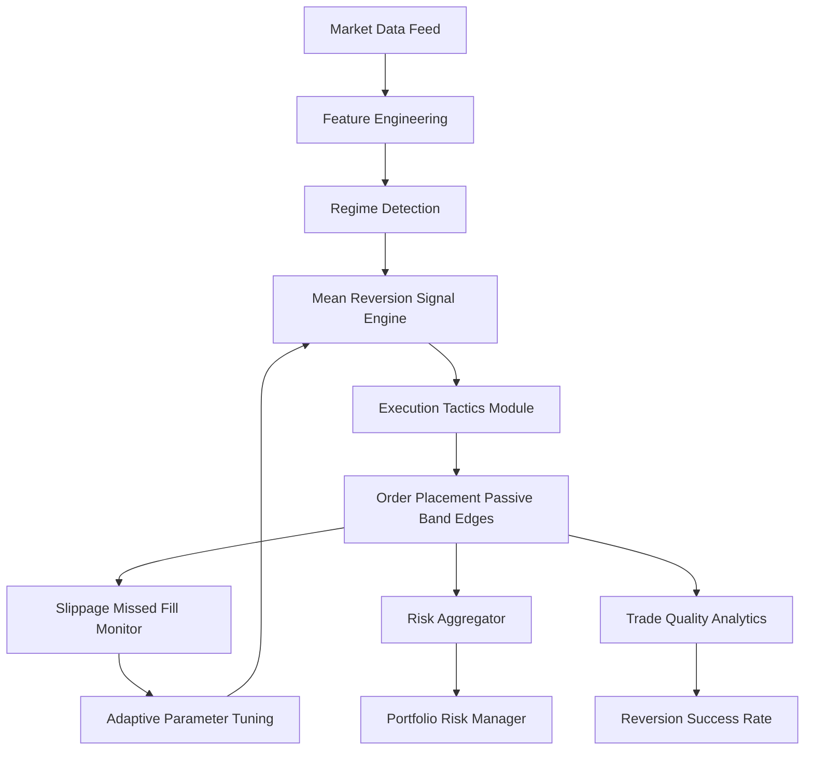
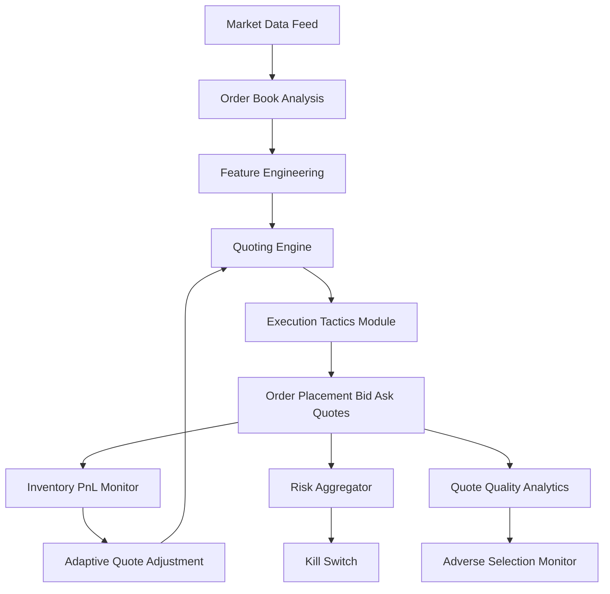
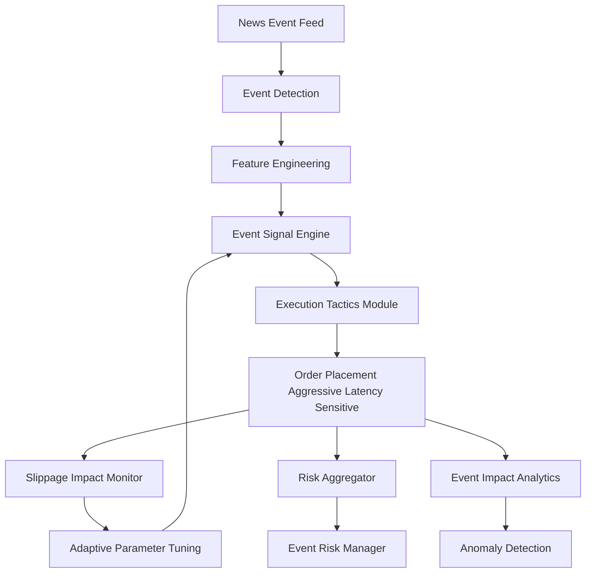
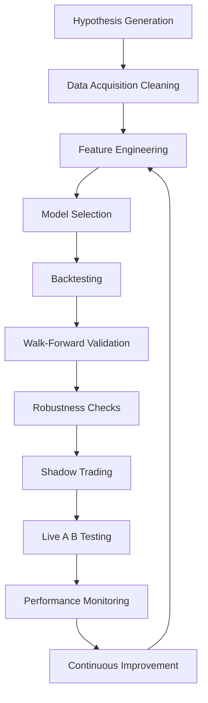
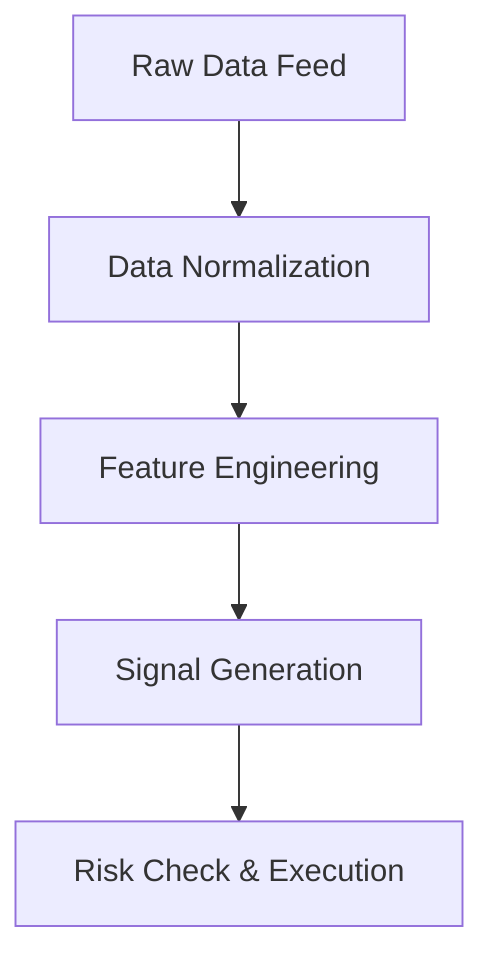
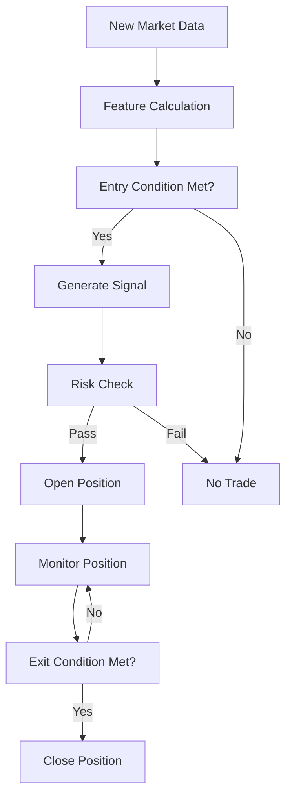
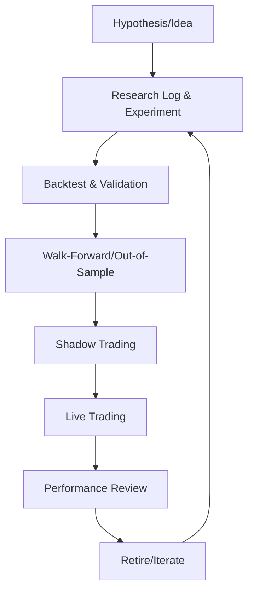

# Strategy Framework

## 1. Strategy Plug-in Architecture



---

## 2. Strategy Lifecycle Sequence



---

## 3. State Management & Extensibility
- Each strategy maintains its own persistent state (for ML models, signals, etc.).
- Feature store provides engineered features for all strategies.
- Strategies are loaded dynamically via config (plug-in pattern).
- Inter-strategy communication via message bus for portfolio-level logic.

---

## 4. Example Strategy Config (YAML)
```yaml
strategies:
  - name: "Momentum"
    params:
      lookback: 20
      threshold: 0.01
  - name: "MeanReversion"
    params:
      lookback: 50
      entry_z: 2.0
```

---

> **TODO:** Add code snippets for base strategy class and plug-in loader.

---

## 5. Scalping Strategy Playbook (Expert Level)

### 5.1. Market Microstructure Analysis
- Real-time order book snapshots (Level 2 data)
- Spread, depth, and liquidity imbalance features
- Detection of spoofing, layering, and hidden liquidity

### 5.2. Signal Generation Logic
- Microsecond-level event processing
- Features: order book imbalance, last trade direction, queue position, short-term volatility
- ML/statistical models for edge detection (e.g., logistic regression, XGBoost, online learning)

### 5.3. Execution Tactics
- Iceberg orders, layered limit orders, and randomization to avoid detection
- Adaptive order sizing based on real-time liquidity
- Latency-sensitive order placement (nanosecond timestamping)
- Immediate-or-cancel (IOC) and fill-or-kill (FOK) logic

### 5.4. Advanced Risk & Capital Management
- Dynamic position sizing (Kelly, volatility targeting)
- Real-time drawdown and exposure aggregation
- Hard/soft kill switches for adverse events
- Real-time PnL attribution by micro-strategy

### 5.5. Monitoring & Adaptive Logic
- Real-time trade quality analytics (slippage, fill ratio, opportunity cost)
- Anomaly detection (latency spikes, fill anomalies, market regime shifts)
- Online parameter tuning (bandit algorithms, reinforcement learning)

### 5.6. End-to-End Scalping Flow Diagram



### 5.7. Actionable Implementation Notes
- Use MT5's tick-by-tick data and Level 2 order book (if available)
- Implement a high-resolution event loop (asyncio, multi-threading, or C++ extension)
- Integrate with a low-latency clock source for timestamping
- Maintain a rolling window of order book states for feature extraction
- Use a plug-in system for execution tactics (easy to swap between iceberg, layering, etc.)
- Log every order, fill, and rejection with nanosecond precision
- Monitor and adapt parameters in real time based on trade outcomes

---

> **TODO:** Add pseudocode and code snippets for each module in the scalping playbook.

---

## 6. Momentum Intraday Strategy Playbook (Expert Level)

### 6.1. Regime Detection & Feature Engineering
- Real-time volatility and trend regime classification (e.g., using HMM, clustering, or rolling stats)
- Features: price momentum (multi-timeframe), volume surges, volatility breakout, order flow imbalance
- Adaptive feature selection based on regime

### 6.2. Signal Generation Logic
- Multi-timeframe momentum signals (e.g., 1min, 5min, 15min)
- Confirmation with volume and volatility filters
- ML/statistical models for false breakout filtering (e.g., random forest, ensemble models)
- Signal decay and time-to-live logic

### 6.3. Execution Tactics
- Aggressive vs. passive order selection based on spread and urgency
- VWAP/TWAP slicing for large orders
- Dynamic order routing (smart order router, venue selection if multi-broker)
- Slippage and adverse selection monitoring

### 6.4. Advanced Risk & Capital Management
- Volatility-adjusted position sizing
- Real-time max adverse excursion (MAE) and max favorable excursion (MFE) tracking
- Regime-dependent stop-loss/take-profit logic
- Portfolio-level risk aggregation and exposure limits

### 6.5. Monitoring & Adaptive Logic
- Real-time signal quality analytics (hit rate, average return per signal, regime PnL attribution)
- Regime shift detection and auto-deactivation/reactivation of strategy
- Online hyperparameter tuning (Bayesian optimization, rolling window validation)

### 6.6. End-to-End Momentum Flow Diagram


### 6.7. Actionable Implementation Notes
- Use rolling window statistics and ML models for regime detection
- Engineer features for both price and volume momentum, volatility, and order flow
- Implement a signal decay mechanism to avoid stale trades
- Use a smart order router for best execution based on urgency and market conditions
- Monitor regime PnL attribution to deactivate underperforming regimes
- Continuously tune hyperparameters using online validation

---

> **TODO:** Add pseudocode and code snippets for each module in the momentum playbook.

---

## 7. Statistical Arbitrage (Stat-Arb) Strategy Playbook (Expert Level)

### 7.1. Pair/Portfolio Selection & Feature Engineering
- Universe screening for cointegrated pairs or mean-reverting baskets (e.g., using Johansen test, PCA)
- Features: spread, z-score, half-life of mean reversion, volatility, correlation breakdown
- Dynamic pair re-selection and portfolio rebalancing

### 7.2. Signal Generation Logic
- Entry/exit signals based on spread z-score thresholds
- Adaptive thresholds based on volatility and regime
- ML/statistical models for false signal filtering (e.g., regime-switching models, HMM)
- Signal decay and time-to-live logic

### 7.3. Execution Tactics
- Synchronous order placement for both legs (or basket)
- Slippage and leg imbalance monitoring
- Smart order routing to minimize market impact
- Dynamic hedging and rebalancing

### 7.4. Advanced Risk & Capital Management
- Dollar/volatility-neutral position sizing
- Real-time tracking of spread convergence/divergence
- Stop-loss/take-profit logic based on spread and portfolio risk
- Portfolio-level risk aggregation and exposure limits

### 7.5. Monitoring & Adaptive Logic
- Real-time spread monitoring and alerting for breakdowns
- Trade quality analytics (convergence time, slippage, leg imbalance)
- Online re-calibration of pairs and thresholds

### 7.6. End-to-End Stat-Arb Flow Diagram


### 7.7. Actionable Implementation Notes
- Use rolling window cointegration and mean reversion tests for pair selection
- Engineer features for spread, volatility, and regime detection
- Implement synchronous order placement and dynamic hedging
- Monitor leg imbalance and slippage in real time
- Continuously re-calibrate pairs and thresholds based on market conditions

---

> **TODO:** Add pseudocode and code snippets for each module in the stat-arb playbook.

---

## 8. Mean Reversion Strategy Playbook (Expert Level)

### 8.1. Feature Engineering & Regime Detection
- Identify mean-reverting assets using rolling z-score, ADF test, or Hurst exponent
- Features: price deviation from mean, volatility bands, order flow reversals, liquidity pockets
- Regime detection for trending vs. mean-reverting markets

### 8.2. Signal Generation Logic
- Entry/exit signals based on z-score, Bollinger Bands, or custom mean-reversion indicators
- Confirmation with volume and order flow reversal
- Adaptive thresholds and time-to-live for signals

### 8.3. Execution Tactics
- Passive order placement to capture reversion (limit orders at band edges)
- Dynamic order sizing based on deviation magnitude and liquidity
- Slippage and missed fill monitoring

### 8.4. Advanced Risk & Capital Management
- Volatility-adjusted sizing and max position limits
- Real-time tracking of open mean-reversion trades and exposure
- Stop-loss/take-profit logic based on mean reversion failure

### 8.5. Monitoring & Adaptive Logic
- Real-time trade quality analytics (mean reversion success rate, average reversion time)
- Regime shift detection and auto-deactivation/reactivation
- Online parameter tuning (rolling window validation)

### 8.6. End-to-End Mean Reversion Flow Diagram



### 8.7. Actionable Implementation Notes
- Use rolling window statistics and regime detection for signal adaptation
- Place passive limit orders at statistically significant band edges
- Monitor mean reversion success rate and adapt thresholds accordingly
- Deactivate strategy in trending regimes

---

## 9. Market Making Strategy Playbook (Expert Level)

### 9.1. Microstructure & Feature Engineering
- Real-time order book analysis (spread, depth, queue position)
- Features: imbalance, last trade direction, volatility, liquidity holes
- Detection of toxic flow and adverse selection

### 9.2. Quoting & Signal Generation Logic
- Dynamic bid/ask quoting based on inventory, volatility, and market conditions
- Skewing quotes to manage inventory and avoid toxic flow
- ML/statistical models for quote adjustment (e.g., reinforcement learning)

### 9.3. Execution Tactics
- Smart order placement to maximize fill probability and minimize adverse selection
- Real-time inventory and PnL tracking
- Quote cancellation and re-quoting logic

### 9.4. Advanced Risk & Capital Management
- Inventory limits and dynamic position adjustment
- Real-time PnL and risk aggregation
- Kill switch for inventory or PnL breaches

### 9.5. Monitoring & Adaptive Logic
- Real-time quote quality analytics (fill ratio, adverse selection, inventory turnover)
- Anomaly detection (toxic flow, quote stuffing)
- Online learning for quote adjustment

### 9.6. End-to-End Market Making Flow Diagram



### 9.7. Actionable Implementation Notes
- Use high-frequency order book data for real-time quoting
- Skew quotes based on inventory and market conditions
- Monitor fill ratio and adverse selection in real time
- Use online learning to adapt quoting strategy

---

## 10. Event-Driven/News Strategy Playbook (Expert Level)

### 10.1. Event Detection & Feature Engineering
- Real-time news/event feed integration (economic releases, earnings, headlines)
- Features: event type, surprise factor, historical impact, sentiment analysis
- Detection of scheduled vs. unscheduled events

### 10.2. Signal Generation Logic
- Pre-event positioning and post-event reaction logic
- ML/statistical models for event impact prediction (e.g., NLP, regression)
- Adaptive signal decay and time-to-live

### 10.3. Execution Tactics
- Aggressive order placement for high-impact events
- Latency-sensitive execution (pre-positioning, instant reaction)
- Slippage and market impact monitoring

### 10.4. Advanced Risk & Capital Management
- Event-specific position sizing and risk limits
- Real-time drawdown and exposure tracking during event windows
- Hard/soft kill switches for extreme volatility

### 10.5. Monitoring & Adaptive Logic
- Real-time event impact analytics (PnL, slippage, volatility)
- Anomaly detection (unexpected market reaction, data errors)
- Online adaptation of event playbooks

### 10.6. End-to-End Event-Driven Flow Diagram



### 10.7. Actionable Implementation Notes
- Integrate with real-time news/event APIs and sentiment analysis tools
- Pre-position or react instantly based on event type and predicted impact
- Monitor PnL and volatility during event windows
- Adapt event playbooks based on post-event analytics

---

> **TODO:** Add pseudocode and code snippets for each module in the mean reversion, market making, and event-driven playbooks.

---

## 11. Alpha Research & Deployment Pipeline (Expert Level)

### 11.1. Alpha Research Workflow
- Hypothesis generation (market intuition, data mining, academic research)
- Data acquisition and cleaning (tick, order book, alternative data)
- Feature engineering (price, volume, order flow, sentiment, alternative data)
- Model selection (statistical, ML, deep learning, hybrid)
- Backtesting with realistic slippage, latency, and market impact
- Walk-forward and out-of-sample validation
- Robustness checks (overfitting, regime shifts, data snooping)

### 11.2. Deployment Pipeline
- Shadow trading (paper trading with live data, no real capital)
- Live A/B testing (split capital between new and proven strategies)
- Performance monitoring and risk checks in real time
- Continuous improvement (feedback loop from live results to research)

### 11.3. Alpha Research & Deployment Flow Diagram



### 11.4. Actionable Implementation Notes
- Use versioned datasets and code for full reproducibility
- Maintain a research log for hypotheses, results, and lessons learned
- Automate walk-forward and robustness testing
- Deploy new alphas in shadow mode before allocating real capital
- Use a feedback loop to refine features, models, and parameters based on live results

---

> **TODO:** Add pseudocode and code snippets for each stage of the alpha research pipeline.

---

## 13. Strategy Data Requirements & Signal Logic

| Strategy      | Lookback (Bars) | Data Normalization / Features      | Signal Trigger Example                        |
|---------------|-----------------|------------------------------------|-----------------------------------------------|
| Scalping      | 50              | Raw price, order book, spread      | Imbalance > 0.6 & spread > 0.0001             |
| Momentum      | 10, 20, 50, 100 | Rolling mean, std, ROC, breakout   | ROC > 1% or price > recent high/low           |
| Mean Reversion| 20, 50          | Z-score, rolling mean/std          | Z-score > 2 or < -2                           |
| Stat-Arb      | 100+            | Spread, z-score, cointegration     | Spread z-score > 2 or < -2                    |
| Market Making | 10              | Mid, bid/ask, inventory, volatility| Inventory/volatility-based quoting            |
| Event-Driven  | N/A             | Event features, sentiment, surprise| Event detected & sentiment > 0.7 or < -0.7    |

### Notes:
- **Lookback (Bars):** Number of historical bars used for rolling calculations or features.
- **Data Normalization / Features:** How raw data is transformed (e.g., rolling mean, z-score, order book features).
- **Signal Trigger Example:** Typical condition(s) that generate a buy/sell signal for each strategy.

#### How to Adjust:
- You can change lookback windows and normalization logic in each strategy’s config or code.
- Signal triggers are defined in each strategy’s `generate_signal` method—customize as needed for your edge.

---

## 14. Data Preparation Examples

### Scalping (Order Book Imbalance)
```python
# Fetch last 50 bars of order book data
data = data_feed.get_order_book(symbol)
# No normalization, but extract features:
imbalance = sum(list(data['bids'].values())[:5]) - sum(list(data['asks'].values())[:5])
spread = min(data['asks'].keys()) - max(data['bids'].keys())
```

### Momentum (Rolling Mean & ROC)
```python
# Fetch last 100 bars of price data
data = data_feed.get_price_data(symbol, lookback=100)
# Normalize: calculate rolling mean and rate of change
rolling_mean = data['close'].rolling(20).mean()
roc = (data['close'] - data['close'].shift(20)) / data['close'].shift(20)
```

### Mean Reversion (Z-Score)
```python
# Fetch last 50 bars of price data
data = data_feed.get_price_data(symbol, lookback=50)
# Normalize: calculate z-score
mean = data['close'].rolling(20).mean()
std = data['close'].rolling(20).std()
zscore = (data['close'] - mean) / std
```

---

## 15. Data-to-Signal Flow Diagram



---

## 16. Common Pitfalls & Best Practices

- **Pitfall:** Using too short a lookback window can make signals noisy and overfit.
  - **Best Practice:** Use rolling windows that match the strategy’s time horizon and test with backtesting.
- **Pitfall:** Not normalizing data for ML-based strategies can lead to poor model performance.
  - **Best Practice:** Always standardize or normalize features for ML models.
- **Pitfall:** Hard-coding signal thresholds without validation.
  - **Best Practice:** Tune thresholds using historical data and walk-forward analysis.
- **Pitfall:** Ignoring data quality (missing bars, outliers).
  - **Best Practice:** Implement data quality checks and handle missing/outlier data gracefully.
- **Pitfall:** Overlapping signals from multiple strategies causing risk concentration.
  - **Best Practice:** Aggregate risk and PnL attribution by strategy and symbol; use portfolio-level risk controls.

---

## 17. Step-by-Step Example: From Data to Trade

**Example: Momentum Strategy on EURUSD**

1. **Fetch Data:**
   ```python
   data = data_feed.get_price_data('EURUSD', lookback=100)
   ```
2. **Normalize/Engineer Features:**
   ```python
   rolling_mean = data['close'].rolling(20).mean()
   roc = (data['close'] - data['close'].shift(20)) / data['close'].shift(20)
   ```
3. **Generate Signal:**
   ```python
   if roc.iloc[-1] > 0.01:
       signal = Signal(..., signal_type=SignalType.BUY, ...)
   else:
       signal = None
   ```
4. **Risk Check:**
   - The signal is passed to the risk manager, which checks position size, VaR, drawdown, etc.
5. **Execute Trade:**
   - If approved, the execution engine places a market order via MT5.
6. **Log & Monitor:**
   - The trade, signal, and outcome are logged and shown on the dashboard.

---

## 18. FAQ: Data, Signals, and Strategy Tuning

**Q: How do I change the lookback window for a strategy?**
- A: Edit the `lookback` parameter in the strategy’s config or code (e.g., `momentum_lookback: 20`).

**Q: How do I add a new feature (e.g., volatility) to my strategy?**
- A: In your strategy’s `generate_signal` method, compute the feature (e.g., `data['close'].rolling(20).std()`) and use it in your signal logic.

**Q: How do I debug why a signal wasn’t generated?**
- A: Check the data window, feature values, and signal conditions in your strategy’s code. Use logging to print intermediate values.

**Q: How do I test changes before going live?**
- A: Use the backtesting engine to simulate your strategy on historical data and review performance metrics.

**Q: How do I ensure my data is clean and reliable?**
- A: Use the data quality monitoring tools described in `docs/data_pipeline.md` and handle missing/outlier data in your preprocessing.

---

## 19. Troubleshooting Signals & Data

- **No signals generated?**
  - Check if your data window is large enough for the lookback period.
  - Print/log feature values and thresholds in your `generate_signal` method.
  - Ensure your data feed is up-to-date and not missing bars.
  - Confirm your signal logic is not too restrictive.

- **Unexpected or too many signals?**
  - Review your feature calculations for errors or outliers.
  - Check for data quality issues (spikes, gaps).
  - Adjust thresholds or add additional filters.

- **Data gaps or NaNs?**
  - Use `.dropna()` or fill missing values in your preprocessing.
  - Implement data quality checks as described in `docs/data_pipeline.md`.

- **Risk manager blocks all trades?**
  - Review risk parameters (VaR, drawdown, position size) in your config.
  - Log risk checks and reasons for rejection.

---

## 20. Advanced Customization

- **Add custom features (e.g., alternative data, ML features):**
  - In your strategy, fetch or compute new features (e.g., sentiment, options flow).
  - Normalize/standardize as needed.
  - Use in your `generate_signal` logic.

- **Custom risk logic per strategy:**
  - Override `process_signal` or add custom risk checks in your strategy class.
  - Example: tighter stop-loss for high-volatility regimes.

- **Custom execution logic:**
  - Override execution methods to use special order types (iceberg, TWAP, etc.).
  - Integrate with external execution algos if needed.

---

## 21. New Strategy Template

```python
from strategies.base_strategy import BaseStrategy, Signal, SignalType

class MyNewStrategy(BaseStrategy):
    def generate_signal(self, symbol, data):
        # Example: simple moving average crossover
        short_ma = data['close'].rolling(10).mean()
        long_ma = data['close'].rolling(50).mean()
        if short_ma.iloc[-1] > long_ma.iloc[-1]:
            return Signal(
                timestamp=data.index[-1],
                symbol=symbol,
                signal_type=SignalType.BUY,
                strength=1.0,
                price=data['close'].iloc[-1],
                confidence=0.8,
                metadata={}
            )
        elif short_ma.iloc[-1] < long_ma.iloc[-1]:
            return Signal(
                timestamp=data.index[-1],
                symbol=symbol,
                signal_type=SignalType.SELL,
                strength=1.0,
                price=data['close'].iloc[-1],
                confidence=0.8,
                metadata={}
            )
        return None
```

---

## 22. Setup Grading (A+, A, B+, B, C+, C)

### What is Setup Grading?
Setup grading is a way to quantify the quality or conviction of a trade setup. Higher grades (A+, A) mean more criteria are met, higher expected edge, and greater confidence. Lower grades (B, C) mean fewer confirmations or more risk.

### Example Grading Criteria
- **A+ Setup:** All signals align (e.g., strong momentum, volume surge, regime confirmation, no conflicting signals)
- **A Setup:** Most signals align, minor confirmation missing
- **B+ / B Setup:** Decent, but with some risk or missing confirmations
- **C+ / C Setup:** Marginal, low edge, only take in special circumstances or for learning

### How to Implement in Code
Add a `setup_grade` field to the `Signal` class and assign it in your strategy:

```python
class MomentumStrategy(BaseStrategy):
    def generate_signal(self, symbol, data):
        roc = (data['close'].iloc[-1] - data['close'].iloc[-20]) / data['close'].iloc[-20]
        volume_surge = data['volume'].iloc[-1] > data['volume'].rolling(20).mean().iloc[-1] * 1.5
        regime = self.detect_regime(symbol, data)
        
        # Grading logic
        if roc > 0.02 and volume_surge and regime == 'trending':
            grade = 'A+'
        elif roc > 0.015 and (volume_surge or regime == 'trending'):
            grade = 'A'
        elif roc > 0.01:
            grade = 'B'
        else:
            grade = 'C'
        
        if grade != 'C':
            return Signal(
                timestamp=data.index[-1],
                symbol=symbol,
                signal_type=SignalType.BUY,
                strength=1.0,
                price=data['close'].iloc[-1],
                confidence=0.8,
                metadata={'setup_grade': grade}
            )
        return None
```

### Position Sizing by Setup Grade

| Setup Grade | Position Size (Fraction of Max) |
|-------------|-------------------------------|
| A+          | 1.0 (Full size)               |
| A           | 0.75                          |
| B+          | 0.5                           |
| B           | 0.33                          |
| C+ / C      | 0.1 or skip                   |

**Tip:** In your `calculate_position_size` method, multiply the base size by the grade’s fraction.

### Why Use Setup Grading?
- **Risk Management:** Take more risk on high-conviction trades, less on marginal ones.
- **Performance Review:** Attribute PnL by grade to see where your real edge is.
- **Continuous Improvement:** Focus research on improving or filtering out lower-grade setups.

---

## 23. Entry & Exit Conditions: Summary Table

| Strategy      | Entry Condition Example                        | Exit Condition Example                        |
|---------------|-----------------------------------------------|-----------------------------------------------|
| Scalping      | Order book imbalance > 0.6 & spread > 0.0001  | Take profit, stop loss, or max holding time   |
| Momentum      | ROC > 1% or price > recent high/low           | Opposite signal, stop loss, or time stop      |
| Mean Reversion| Z-score > 2 or < -2                           | Z-score returns to 0, stop loss, or time stop |
| Stat-Arb      | Spread z-score > 2 or < -2                    | Spread mean reverts, stop loss, or time stop  |
| Market Making | Inventory/volatility-based quoting            | Inventory limit, adverse selection, time stop |
| Event-Driven  | Event detected & sentiment > 0.7 or < -0.7    | Post-event window, stop loss, or opposite     |

---

## 24. Advanced Exit Logic Examples

- **Trailing Stop:**
  ```python
  # Update stop loss as price moves in your favor
  if position.side == 'LONG':
      position.stop_loss = max(position.stop_loss, current_price - trailing_amount)
  elif position.side == 'SHORT':
      position.stop_loss = min(position.stop_loss, current_price + trailing_amount)
  ```
- **Volatility-Based Exit:**
  ```python
  # Exit if volatility spikes above threshold
  if data['close'].rolling(20).std().iloc[-1] > vol_threshold:
      close_position()
  ```
- **Time-Based Exit:**
  ```python
  # Exit after N bars or seconds
  if (current_time - position.entry_time).total_seconds() > max_holding_time:
      close_position()
  ```
- **Multi-Leg Exit (Stat-Arb):**
  ```python
  # Close both legs when spread mean reverts
  if abs(spread_zscore) < 0.5:
      close_all_positions()
  ```

---

## 25. Customizing Entry/Exit Logic

- **Tune thresholds** (e.g., z-score, ROC, spread) in your strategy’s config or code.
- **Add filters** (e.g., avoid trading during news, low liquidity, or high volatility periods).
- **Combine multiple conditions** (e.g., require both momentum and volume surge).
- **Use ML models** to predict optimal entry/exit points.
- **Backtest** all changes before deploying live.

---

## 26. FAQ: Entry/Exit Logic

**Q: How do I add a trailing stop to my strategy?**
- A: Update the stop loss dynamically as price moves in your favor (see example above).

**Q: How do I avoid trading during news or high volatility?**
- A: Add a filter in your `generate_signal` method to skip signals during those periods.

**Q: How do I implement a time-based exit?**
- A: Track entry time and close the position after a set duration (see example above).

**Q: How do I test new entry/exit logic?**
- A: Use the backtesting engine to simulate and review performance before going live.

**Q: Can I use multiple exit conditions?**
- A: Yes! Most strategies combine stop loss, take profit, time stop, and opposite signal exits for robustness.

---

## 27. Entry/Exit Logic Flowchart



---

## 28. Edge Cases & Real-World Scenarios

- **Partial Fills:**
  - Track filled vs. unfilled size; update position and risk accordingly.
  - Consider re-issuing or canceling remaining order.
- **Slippage:**
  - Compare expected vs. actual fill price; log and analyze slippage.
  - Adjust future order logic or risk if slippage is persistent.
- **Missed Exits:**
  - Monitor for missed stop loss/take profit due to gaps or illiquidity.
  - Add fallback logic (e.g., market order exit if limit not filled).
- **Execution Errors:**
  - Log all errors; retry or escalate as needed.
  - Use monitoring/alerting to catch and respond to failures in real time.
- **Market Halts/News Events:**
  - Add logic to pause trading or flatten positions during scheduled/unscheduled halts or major news.

---

## 29. Checklist for Entry/Exit Logic Review

- [ ] Are all entry and exit conditions clearly defined and tested?
- [ ] Are thresholds and lookbacks appropriate for the strategy’s time frame?
- [ ] Are there filters for no-trade periods (e.g., news, low liquidity)?
- [ ] Is there logic for all possible exits (stop loss, take profit, time, opposite signal)?
- [ ] Are edge cases (partial fills, slippage, missed exits) handled?
- [ ] Is all logic backtested and reviewed for robustness?
- [ ] Are all signals, trades, and exits logged for audit and review?
- [ ] Is there a monitoring/alerting system for execution errors or missed exits?

---

## 30. Research Log Template

| Date       | Hypothesis/Idea | Data Used | Method | Results | Next Steps | Reviewer |
|------------|-----------------|-----------|--------|---------|------------|----------|
| YYYY-MM-DD |                 |           |        |         |            |          |

## 31. Alpha Lifecycle Flow



## 32. Post-Mortem Template

| Date       | Incident/Issue | Impact | Root Cause | Resolution | Lessons Learned | Action Items | Owner |
|------------|----------------|--------|------------|------------|----------------|--------------|-------|
| YYYY-MM-DD |                |        |            |            |                |              |       |

---

## 33. Case Studies & Lessons Learned

### Example: Flash Crash Incident
- **Date:** 2023-05-12
- **Incident:** Sudden market crash triggered stop-losses across all strategies
- **Impact:** Large drawdown, several positions closed at unfavorable prices
- **Root Cause:** Lack of circuit breaker logic and insufficient volatility filters
- **Resolution:** Added circuit breaker, improved volatility detection, and updated risk limits
- **Lessons Learned:**
  - Always have circuit breakers for extreme events
  - Regularly review and stress test risk parameters
  - Monitor for market regime shifts

### Case Study Template
| Date       | Incident/Issue | Impact | Root Cause | Resolution | Lessons Learned | Action Items | Owner |
|------------|----------------|--------|------------|------------|----------------|--------------|-------|
| YYYY-MM-DD |                |        |            |            |                |              |       |

---

## 34. Jupyter/Notebook Research Template

```markdown
# Research Title

## 1. Hypothesis/Objective
- What are you testing or exploring?

## 2. Data Used
- Source, time period, features

## 3. Methodology
- Feature engineering, model, backtest setup

## 4. Results
- Plots, tables, metrics

## 5. Interpretation
- What do the results mean?

## 6. Next Steps
- Further research, deployment, or discard

## 7. Reviewer Comments
- Peer review notes
```

## 35. Experiment Reproducibility Checklist
- [ ] All code and data are versioned (Git, DVC, etc.)
- [ ] Random seeds set for all stochastic processes
- [ ] All dependencies and environment details documented
- [ ] Results and figures saved with code
- [ ] Peer review completed and logged
- [ ] Research log entry created/updated

---

## 36. ML Model Governance Template

| Model Name | Owner | Approval Status | Last Validation | Retrain Schedule | Monitoring Metrics | Notes |
|------------|-------|----------------|-----------------|------------------|-------------------|-------|
|            |       |                |                 |                  |                   |       |

- All models must be registered, approved, and regularly validated.
- Monitoring includes drift detection, performance, and risk metrics.

## 37. ML Experiment Tracking Integration
- Use MLflow, DVC, or similar tools for:
  - Versioning code, data, and parameters
  - Tracking experiments, metrics, and artifacts
  - Reproducibility and auditability
- Integrate experiment tracking with research log and model inventory

---
