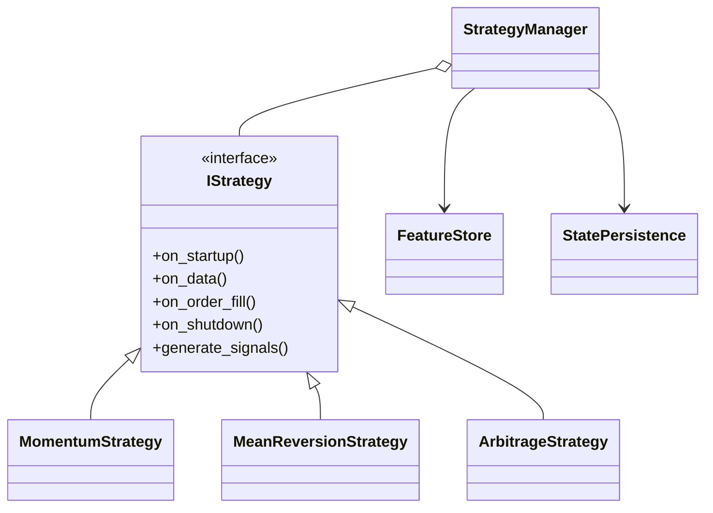
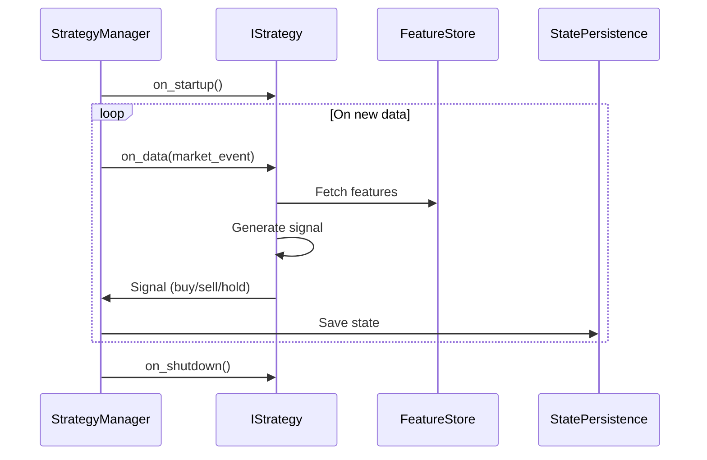
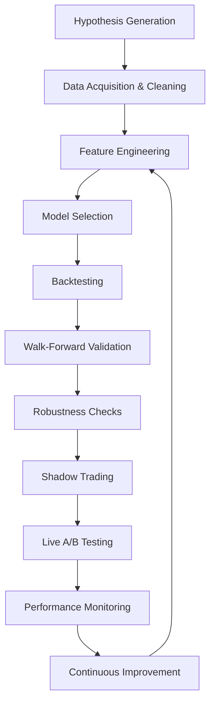

# Strategy Framework

## 1. Strategy Plug-in Architecture



---

## 2. Strategy Lifecycle Sequence



---

## 3. State Management & Extensibility
- Each strategy maintains its own persistent state (for ML models, signals, etc.).
- Feature store provides engineered features for all strategies.
- Strategies are loaded dynamically via config (plug-in pattern).
- Inter-strategy communication via message bus for portfolio-level logic.

---

## 4. Example Strategy Config (YAML)
```yaml
strategies:
  - name: "Momentum"
    params:
      lookback: 20
      threshold: 0.01
  - name: "MeanReversion"
    params:
      lookback: 50
      entry_z: 2.0
```

---

> **TODO:** Add code snippets for base strategy class and plug-in loader.

---

## 5. Scalping Strategy Playbook (Expert Level)

### 5.1. Market Microstructure Analysis
- Real-time order book snapshots (Level 2 data)
- Spread, depth, and liquidity imbalance features
- Detection of spoofing, layering, and hidden liquidity

### 5.2. Signal Generation Logic
- Microsecond-level event processing
- Features: order book imbalance, last trade direction, queue position, short-term volatility
- ML/statistical models for edge detection (e.g., logistic regression, XGBoost, online learning)

### 5.3. Execution Tactics
- Iceberg orders, layered limit orders, and randomization to avoid detection
- Adaptive order sizing based on real-time liquidity
- Latency-sensitive order placement (nanosecond timestamping)
- Immediate-or-cancel (IOC) and fill-or-kill (FOK) logic

### 5.4. Advanced Risk & Capital Management
- Dynamic position sizing (Kelly, volatility targeting)
- Real-time drawdown and exposure aggregation
- Hard/soft kill switches for adverse events
- Real-time PnL attribution by micro-strategy

### 5.5. Monitoring & Adaptive Logic
- Real-time trade quality analytics (slippage, fill ratio, opportunity cost)
- Anomaly detection (latency spikes, fill anomalies, market regime shifts)
- Online parameter tuning (bandit algorithms, reinforcement learning)

### 5.6. End-to-End Scalping Flow Diagram

```mermaid
flowchart TD
    A[Market Data Feed] --> B[Order Book Snapshot]
    B --> C[Microstructure Feature Extraction]
    C --> D[Scalping Signal Engine]
    D --> E[Execution Tactics Module]
    E --> F[Order Placement (Iceberg, Layered)]
    F --> G[Real-Time Fill/Slippage Analysis]
    G --> H[Adaptive Parameter Tuning]
    H --> D
    F --> I[Risk Aggregator]
    I --> J[Kill Switch/Auto-Deleveraging]
    F --> K[Trade Quality Analytics]
    K --> L[Post-Trade Forensics]
```

### 5.7. Actionable Implementation Notes
- Use MT5's tick-by-tick data and Level 2 order book (if available)
- Implement a high-resolution event loop (asyncio, multi-threading, or C++ extension)
- Integrate with a low-latency clock source for timestamping
- Maintain a rolling window of order book states for feature extraction
- Use a plug-in system for execution tactics (easy to swap between iceberg, layering, etc.)
- Log every order, fill, and rejection with nanosecond precision
- Monitor and adapt parameters in real time based on trade outcomes

---

> **TODO:** Add pseudocode and code snippets for each module in the scalping playbook.

---

## 6. Momentum Intraday Strategy Playbook (Expert Level)

### 6.1. Regime Detection & Feature Engineering
- Real-time volatility and trend regime classification (e.g., using HMM, clustering, or rolling stats)
- Features: price momentum (multi-timeframe), volume surges, volatility breakout, order flow imbalance
- Adaptive feature selection based on regime

### 6.2. Signal Generation Logic
- Multi-timeframe momentum signals (e.g., 1min, 5min, 15min)
- Confirmation with volume and volatility filters
- ML/statistical models for false breakout filtering (e.g., random forest, ensemble models)
- Signal decay and time-to-live logic

### 6.3. Execution Tactics
- Aggressive vs. passive order selection based on spread and urgency
- VWAP/TWAP slicing for large orders
- Dynamic order routing (smart order router, venue selection if multi-broker)
- Slippage and adverse selection monitoring

### 6.4. Advanced Risk & Capital Management
- Volatility-adjusted position sizing
- Real-time max adverse excursion (MAE) and max favorable excursion (MFE) tracking
- Regime-dependent stop-loss/take-profit logic
- Portfolio-level risk aggregation and exposure limits

### 6.5. Monitoring & Adaptive Logic
- Real-time signal quality analytics (hit rate, average return per signal, regime PnL attribution)
- Regime shift detection and auto-deactivation/reactivation of strategy
- Online hyperparameter tuning (Bayesian optimization, rolling window validation)

### 6.6. End-to-End Momentum Flow Diagram

```mermaid
flowchart TD
    A[Market Data Feed] --> B[Feature Engineering]
    B --> C[Regime Detection]
    C --> D[Momentum Signal Engine]
    D --> E[Execution Tactics Module]
    E --> F[Order Placement (VWAP/TWAP, Aggressive/Passive)]
    F --> G[Slippage/Adverse Selection Monitor]
    G --> H[Adaptive Parameter Tuning]
    H --> D
    F --> I[Risk Aggregator]
    I --> J[Portfolio Risk Manager]
    F --> K[Signal Quality Analytics]
    K --> L[Regime PnL Attribution]
```

### 6.7. Actionable Implementation Notes
- Use rolling window statistics and ML models for regime detection
- Engineer features for both price and volume momentum, volatility, and order flow
- Implement a signal decay mechanism to avoid stale trades
- Use a smart order router for best execution based on urgency and market conditions
- Monitor regime PnL attribution to deactivate underperforming regimes
- Continuously tune hyperparameters using online validation

---

> **TODO:** Add pseudocode and code snippets for each module in the momentum playbook.

---

## 7. Statistical Arbitrage (Stat-Arb) Strategy Playbook (Expert Level)

### 7.1. Pair/Portfolio Selection & Feature Engineering
- Universe screening for cointegrated pairs or mean-reverting baskets (e.g., using Johansen test, PCA)
- Features: spread, z-score, half-life of mean reversion, volatility, correlation breakdown
- Dynamic pair re-selection and portfolio rebalancing

### 7.2. Signal Generation Logic
- Entry/exit signals based on spread z-score thresholds
- Adaptive thresholds based on volatility and regime
- ML/statistical models for false signal filtering (e.g., regime-switching models, HMM)
- Signal decay and time-to-live logic

### 7.3. Execution Tactics
- Synchronous order placement for both legs (or basket)
- Slippage and leg imbalance monitoring
- Smart order routing to minimize market impact
- Dynamic hedging and rebalancing

### 7.4. Advanced Risk & Capital Management
- Dollar/volatility-neutral position sizing
- Real-time tracking of spread convergence/divergence
- Stop-loss/take-profit logic based on spread and portfolio risk
- Portfolio-level risk aggregation and exposure limits

### 7.5. Monitoring & Adaptive Logic
- Real-time spread monitoring and alerting for breakdowns
- Trade quality analytics (convergence time, slippage, leg imbalance)
- Online re-calibration of pairs and thresholds

### 7.6. End-to-End Stat-Arb Flow Diagram

```mermaid
flowchart TD
    A[Market Data Feed] --> B[Pair/Portfolio Selection]
    B --> C[Feature Engineering]
    C --> D[Stat-Arb Signal Engine]
    D --> E[Execution Tactics Module]
    E --> F[Order Placement (Synchronous, Hedged)]
    F --> G[Leg Imbalance/Slippage Monitor]
    G --> H[Adaptive Parameter Tuning]
    H --> D
    F --> I[Risk Aggregator]
    I --> J[Portfolio Risk Manager]
    F --> K[Trade Quality Analytics]
    K --> L[Spread Breakdown Alert]
```

### 7.7. Actionable Implementation Notes
- Use rolling window cointegration and mean reversion tests for pair selection
- Engineer features for spread, volatility, and regime detection
- Implement synchronous order placement and dynamic hedging
- Monitor leg imbalance and slippage in real time
- Continuously re-calibrate pairs and thresholds based on market conditions

---

> **TODO:** Add pseudocode and code snippets for each module in the stat-arb playbook.

---

## 8. Mean Reversion Strategy Playbook (Expert Level)

### 8.1. Feature Engineering & Regime Detection
- Identify mean-reverting assets using rolling z-score, ADF test, or Hurst exponent
- Features: price deviation from mean, volatility bands, order flow reversals, liquidity pockets
- Regime detection for trending vs. mean-reverting markets

### 8.2. Signal Generation Logic
- Entry/exit signals based on z-score, Bollinger Bands, or custom mean-reversion indicators
- Confirmation with volume and order flow reversal
- Adaptive thresholds and time-to-live for signals

### 8.3. Execution Tactics
- Passive order placement to capture reversion (limit orders at band edges)
- Dynamic order sizing based on deviation magnitude and liquidity
- Slippage and missed fill monitoring

### 8.4. Advanced Risk & Capital Management
- Volatility-adjusted sizing and max position limits
- Real-time tracking of open mean-reversion trades and exposure
- Stop-loss/take-profit logic based on mean reversion failure

### 8.5. Monitoring & Adaptive Logic
- Real-time trade quality analytics (mean reversion success rate, average reversion time)
- Regime shift detection and auto-deactivation/reactivation
- Online parameter tuning (rolling window validation)

### 8.6. End-to-End Mean Reversion Flow Diagram

```mermaid
flowchart TD
    A[Market Data Feed] --> B[Feature Engineering]
    B --> C[Regime Detection]
    C --> D[Mean Reversion Signal Engine]
    D --> E[Execution Tactics Module]
    E --> F[Order Placement (Passive, Band Edges)]
    F --> G[Slippage/Missed Fill Monitor]
    G --> H[Adaptive Parameter Tuning]
    H --> D
    F --> I[Risk Aggregator]
    I --> J[Portfolio Risk Manager]
    F --> K[Trade Quality Analytics]
    K --> L[Reversion Success Rate]
```

### 8.7. Actionable Implementation Notes
- Use rolling window statistics and regime detection for signal adaptation
- Place passive limit orders at statistically significant band edges
- Monitor mean reversion success rate and adapt thresholds accordingly
- Deactivate strategy in trending regimes

---

## 9. Market Making Strategy Playbook (Expert Level)

### 9.1. Microstructure & Feature Engineering
- Real-time order book analysis (spread, depth, queue position)
- Features: imbalance, last trade direction, volatility, liquidity holes
- Detection of toxic flow and adverse selection

### 9.2. Quoting & Signal Generation Logic
- Dynamic bid/ask quoting based on inventory, volatility, and market conditions
- Skewing quotes to manage inventory and avoid toxic flow
- ML/statistical models for quote adjustment (e.g., reinforcement learning)

### 9.3. Execution Tactics
- Smart order placement to maximize fill probability and minimize adverse selection
- Real-time inventory and PnL tracking
- Quote cancellation and re-quoting logic

### 9.4. Advanced Risk & Capital Management
- Inventory limits and dynamic position adjustment
- Real-time PnL and risk aggregation
- Kill switch for inventory or PnL breaches

### 9.5. Monitoring & Adaptive Logic
- Real-time quote quality analytics (fill ratio, adverse selection, inventory turnover)
- Anomaly detection (toxic flow, quote stuffing)
- Online learning for quote adjustment

### 9.6. End-to-End Market Making Flow Diagram

```mermaid
flowchart TD
    A[Market Data Feed] --> B[Order Book Analysis]
    B --> C[Feature Engineering]
    C --> D[Quoting Engine]
    D --> E[Execution Tactics Module]
    E --> F[Order Placement (Bid/Ask Quotes)]
    F --> G[Inventory/PnL Monitor]
    G --> H[Adaptive Quote Adjustment]
    H --> D
    F --> I[Risk Aggregator]
    I --> J[Kill Switch]
    F --> K[Quote Quality Analytics]
    K --> L[Adverse Selection Monitor]
```

### 9.7. Actionable Implementation Notes
- Use high-frequency order book data for real-time quoting
- Skew quotes based on inventory and market conditions
- Monitor fill ratio and adverse selection in real time
- Use online learning to adapt quoting strategy

---

## 10. Event-Driven/News Strategy Playbook (Expert Level)

### 10.1. Event Detection & Feature Engineering
- Real-time news/event feed integration (economic releases, earnings, headlines)
- Features: event type, surprise factor, historical impact, sentiment analysis
- Detection of scheduled vs. unscheduled events

### 10.2. Signal Generation Logic
- Pre-event positioning and post-event reaction logic
- ML/statistical models for event impact prediction (e.g., NLP, regression)
- Adaptive signal decay and time-to-live

### 10.3. Execution Tactics
- Aggressive order placement for high-impact events
- Latency-sensitive execution (pre-positioning, instant reaction)
- Slippage and market impact monitoring

### 10.4. Advanced Risk & Capital Management
- Event-specific position sizing and risk limits
- Real-time drawdown and exposure tracking during event windows
- Hard/soft kill switches for extreme volatility

### 10.5. Monitoring & Adaptive Logic
- Real-time event impact analytics (PnL, slippage, volatility)
- Anomaly detection (unexpected market reaction, data errors)
- Online adaptation of event playbooks

### 10.6. End-to-End Event-Driven Flow Diagram

```mermaid
flowchart TD
    A[News/Event Feed] --> B[Event Detection]
    B --> C[Feature Engineering]
    C --> D[Event Signal Engine]
    D --> E[Execution Tactics Module]
    E --> F[Order Placement (Aggressive, Latency Sensitive)]
    F --> G[Slippage/Impact Monitor]
    G --> H[Adaptive Parameter Tuning]
    H --> D
    F --> I[Risk Aggregator]
    I --> J[Event Risk Manager]
    F --> K[Event Impact Analytics]
    K --> L[Anomaly Detection]
```

### 10.7. Actionable Implementation Notes
- Integrate with real-time news/event APIs and sentiment analysis tools
- Pre-position or react instantly based on event type and predicted impact
- Monitor PnL and volatility during event windows
- Adapt event playbooks based on post-event analytics

---

> **TODO:** Add pseudocode and code snippets for each module in the mean reversion, market making, and event-driven playbooks.

---

## 11. Alpha Research & Deployment Pipeline (Expert Level)

### 11.1. Alpha Research Workflow
- Hypothesis generation (market intuition, data mining, academic research)
- Data acquisition and cleaning (tick, order book, alternative data)
- Feature engineering (price, volume, order flow, sentiment, alternative data)
- Model selection (statistical, ML, deep learning, hybrid)
- Backtesting with realistic slippage, latency, and market impact
- Walk-forward and out-of-sample validation
- Robustness checks (overfitting, regime shifts, data snooping)

### 11.2. Deployment Pipeline
- Shadow trading (paper trading with live data, no real capital)
- Live A/B testing (split capital between new and proven strategies)
- Performance monitoring and risk checks in real time
- Continuous improvement (feedback loop from live results to research)

### 11.3. Alpha Research & Deployment Flow Diagram



### 11.4. Actionable Implementation Notes
- Use versioned datasets and code for full reproducibility
- Maintain a research log for hypotheses, results, and lessons learned
- Automate walk-forward and robustness testing
- Deploy new alphas in shadow mode before allocating real capital
- Use a feedback loop to refine features, models, and parameters based on live results

---

> **TODO:** Add pseudocode and code snippets for each stage of the alpha research pipeline.
