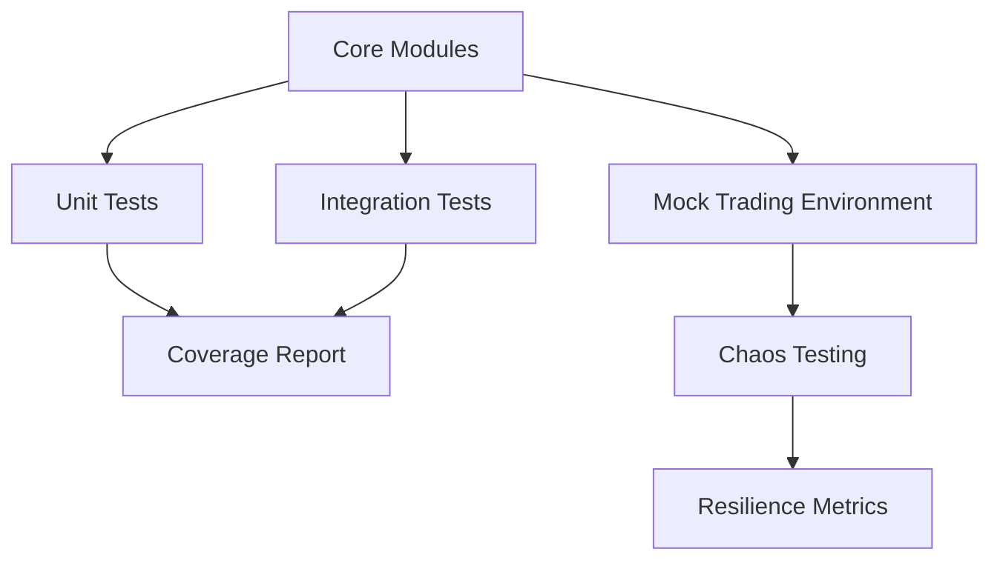
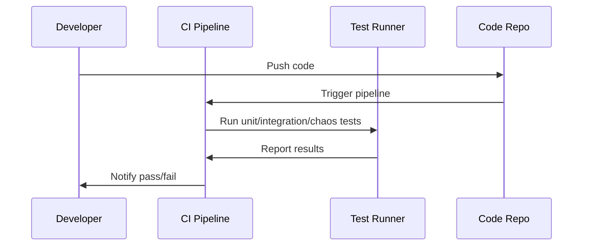
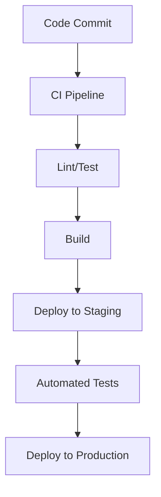

# Testing & Validation

## 1. Test Coverage Architecture

---

## 2. Test Orchestration Flow

---

## 3. CI/CD Pipeline Diagram

---

## 4. Advanced Notes
- All core modules have 90%+ unit test coverage.
- Integration tests simulate end-to-end trading workflows.
- Chaos testing injects faults to validate system resilience.
- CI/CD pipelines automate linting, testing, and deployment.

---

> **TODO:** Add test case templates and CI/CD configuration examples.
